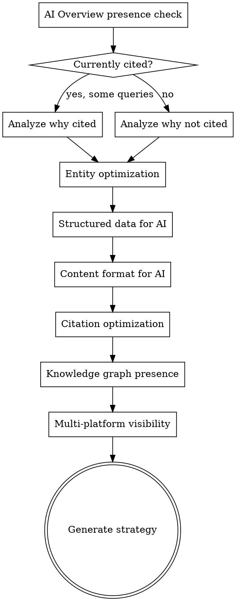

# AI Search Optimization

## Overview

Optimize for AI-powered search experiences — Google AI Overviews, ChatGPT search, Perplexity, Bing Copilot, and other LLM-based search tools. This is an evolving field where strategies must be adaptive. The core principle: authoritative, well-structured, factual content performs well in both traditional and AI search.


**Note:** This field is changing rapidly. Strategies here reflect current best understanding but should be revisited as AI search products evolve.

## The Iron Law

```
AI SEARCH IS A LAYER ON TOP OF SEO, NOT A REPLACEMENT. RANK FIRST, THEN OPTIMIZE FOR CITATION.
```

If you're not ranking organically, you won't be cited in AI Overviews. Google's AI pulls from sources it already trusts. Fix your traditional SEO first — then format your content so AI systems can extract and cite it.

## Checklist

You MUST create a task for each of these items and complete them in order:

1. **AI Overview presence check** — Which target queries trigger AI Overviews? Is the site cited?
2. **Entity optimization** — Are key entities well-defined for LLMs?
3. **Structured data for AI** — Schema types that help AI understand content
4. **Content format for AI extraction** — Clear headings, concise answers, authoritative sourcing
5. **Citation optimization** — How to become a source that AI systems cite
6. **Knowledge graph presence** — Brand panel, entity relationships, factual consistency
7. **Multi-platform visibility** — Optimization across Google, Bing Copilot, ChatGPT, Perplexity
8. **Generate AI search strategy** — Actions to improve AI citation rate + content format recommendations

## Process Flow



## The Process

### Step 1: AI Overview presence check

For 10-20 target keywords, check if AI Overviews appear and whether the site is cited:
- Use WebSearch to check actual SERPs for target queries
- Note which queries trigger AI Overviews
- For each AI Overview, note which sources are cited
- Is the user's site cited? In what position?
- What types of queries trigger AI Overviews in this niche? (Informational, how-to, comparison)

Patterns to identify:
- Queries where you rank organically but aren't cited in AI Overviews
- Queries where competitors are cited but you aren't
- Query types that consistently trigger AI Overviews in your space

### Step 2: Entity optimization

LLMs understand content through entities (people, organizations, products, concepts). Ensure your key entities are well-defined:

**Brand entity:**
- Is there a clear, consistent description of what the brand/business does across the web?
- Is there a Wikipedia or Wikidata entry? (Strongest entity signal)
- Is the brand mentioned on authoritative third-party sources?
- Does structured data on the website define the organization clearly?

**Product/service entities:**
- Are products/services described with clear, factual attributes?
- Are there comparison pages that position products against alternatives?
- Is pricing, availability, and specification data structured and up to date?

**People entities:**
- Are authors/experts identified with author pages, bios, and credentials?
- Are they linked to external profiles (LinkedIn, professional associations)?
- Do they have bylines on external publications?

### Step 3: Structured data for AI

Schema types that help AI systems understand and cite content:

| Schema Type | Why It Helps AI |
|------------|-----------------|
| **Article** | Identifies content as editorial, provides author, date, publisher |
| **FAQPage** | Directly maps questions to answers — easy for AI to extract |
| **HowTo** | Structured step-by-step instructions |
| **Product** | Clear product attributes for comparison queries |
| **Organization** | Defines the entity behind the content |
| **Person** | Connects content to authoritative authors |
| **BreadcrumbList** | Helps AI understand site structure and content hierarchy |
| **Speakable** | Marks content suitable for voice/AI reading |

Implement the most relevant schema types. Ensure all properties are accurate and complete.

### Step 4: Content format for AI extraction

AI systems extract information best from content that is:

**Clear and direct:**
- Answer the question in the first paragraph (inverted pyramid style)
- Use clear, definitive statements ("X is...", "The best way to... is...")
- Avoid burying the answer in preamble

**Well-structured:**
- Descriptive headings that match search queries (H2/H3 as question formats)
- Short paragraphs (2-3 sentences)
- Bullet points and numbered lists for multi-part answers
- Tables for comparisons and data

**Authoritative:**
- Cite sources for claims (links to studies, data, official sources)
- Include author credentials and expertise signals
- Date content and keep it updated
- Use precise, factual language (numbers, dates, specifics)

**Comprehensive:**
- Cover the topic from multiple angles
- Address related questions (People Also Ask)
- Provide context, not just answers
- Include unique data, insights, or perspectives

### Step 5: Citation optimization

To become a source AI systems cite:

**Authority signals:**
- Build topical authority through comprehensive coverage (see `seo-superpowers:content-coverage`)
- Earn mentions and links from authoritative sources
- Demonstrate E-E-A-T (Experience, Expertise, Authoritativeness, Trustworthiness)
- Be cited by other content that AI systems already trust

**Uniqueness signals:**
- Original research and data — AI systems cite unique sources
- First-hand experience and expert analysis
- Unique perspectives or frameworks
- Proprietary tools or calculators

**Freshness signals:**
- Keep content updated with current data
- Publish timely analysis of new developments
- Update dates and statistics regularly

### Step 6: Knowledge graph presence

Check and optimize knowledge graph visibility:

**Brand panel:**
- Search for the brand name — does a knowledge panel appear?
- Is the information accurate and complete?
- Claim the knowledge panel via Google's verification process if available

**Entity relationships:**
- Is the brand associated with the right industry/category?
- Are key people (founders, experts) linked to the brand?
- Are products properly associated with the brand?

**Factual consistency:**
- Is the same factual information (founding date, location, description) consistent across:
  - Website (About page, schema)
  - Wikipedia/Wikidata
  - Google Business Profile
  - Social media profiles
  - Third-party directories

Inconsistencies confuse AI systems and weaken entity confidence.

### Step 7: Multi-platform visibility

Different AI search platforms have different characteristics:

| Platform | Key Factors | Optimization Focus |
|----------|------------|-------------------|
| **Google AI Overviews** | Traditional ranking signals + content quality | Rank well organically first, then optimize for extraction |
| **Bing Copilot** | Bing ranking signals, structured data | Bing Webmaster Tools, social signals |
| **ChatGPT Search** | Content freshness, authority, direct answers | Clear answers, updated content, strong brand signals |
| **Perplexity** | Source credibility, direct answers, freshness | Well-structured content with clear factual statements |

General principles that work across all platforms:
- Be the most authoritative source on your topics
- Structure content for easy extraction
- Keep content fresh and factually accurate
- Build strong entity/brand signals across the web

### Step 8: Generate AI search strategy

Output format:

**Current AI Search Visibility:**

| Query | AI Overview? | Cited? | Organic Rank | Gap |
|-------|-------------|--------|-------------|-----|
| ... | Yes | No | #3 | Format content for extraction |
| ... | Yes | Yes (source #2) | #1 | Maintain/improve |
| ... | No | N/A | #5 | Focus on organic ranking |

**Entity Health:**
- Brand entity strength: Strong / Moderate / Weak
- Key gaps in entity definition
- Recommended actions

**Content Format Recommendations:**
- Pages to restructure for AI extraction (specific recommendations per page)
- Schema types to implement
- Content patterns to adopt

**Priority Actions:**
1. [Quick wins] — Restructure existing high-ranking content for AI extraction
2. [Medium-term] — Build entity signals (schema, third-party mentions, knowledge graph)
3. [Long-term] — Create original research and unique data assets
4. [Ongoing] — Monitor AI citation rates, adapt to platform changes

## Red Flags - STOP and Follow Process

If you catch yourself:
- Optimizing for AI search while ignoring traditional ranking factors — AI search cites pages that already rank well
- Treating AI search optimization as a separate discipline from SEO — it's the same content, structured for an additional surface
- Optimizing for only one AI platform — what works for Google AI Overviews should also help with Perplexity and ChatGPT
- Making content worse for humans to make it "easier for AI" — AI systems are trained to value content humans find useful
- Panicking about AI search "killing SEO" — adapt, don't abandon. The sources AI cites still get visibility.

## Common Rationalizations

| Excuse | Reality |
|--------|---------|
| "Traditional SEO is dead because of AI" | AI search cites traditional organic results. You need to rank to be cited. |
| "We can't optimize for something that changes every month" | The fundamentals don't change: be authoritative, be clear, be structured, be factual. |
| "AI Overviews don't affect our niche" | Check your target queries. AI Overviews are expanding into every vertical. |
| "Entity SEO is too abstract to act on" | Structured data, consistent facts across the web, authoritative third-party mentions — these are concrete actions. |
| "We'll wait until AI search stabilizes" | Your competitors aren't waiting. Early movers who get cited build a reinforcing advantage. |

## Key Principles

- This field is evolving rapidly — strategies should be adaptive, not dogmatic
- Traditional SEO fundamentals still matter — AI search doesn't replace ranking factors, it adds a layer
- Authoritative, well-structured, factual content performs well in both traditional and AI search
- Monitor citation rates, not just rankings — being cited in AI answers has value even without a click
- Don't optimize only for AI — your content must serve human readers first
- Entity SEO is the bridge between traditional and AI search — invest in defining your entities clearly
