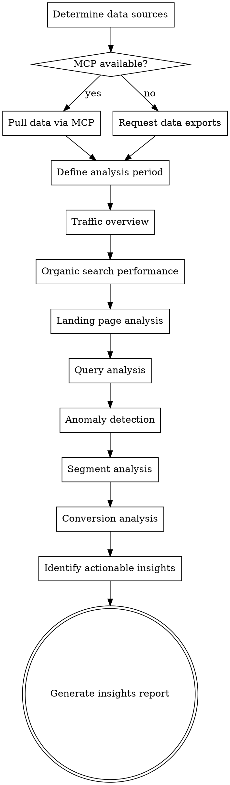

# Analytics Review

## Overview

GA4 and Google Search Console analysis workflow. Investigates traffic trends, organic search performance, landing pages, queries, anomalies, and conversions. Every insight comes with a "so what?" — what the user should DO about the finding.


## The Iron Law

```
EVERY INSIGHT NEEDS A "SO WHAT?" — DATA WITHOUT ACTION IS A VANITY EXERCISE.
```

Reporting that "organic traffic increased 12%" is not an insight. "Organic traffic increased 12%, driven by 3 new blog posts targeting commercial keywords — continue publishing 2 posts/month on this topic cluster" is an insight. If you can't answer "so what should we do about this?", the finding isn't ready.

## Checklist

You MUST create a task for each of these items and complete them in order:

1. **Determine data sources** — Check for analytics-mcp (GA4), GSC MCP, or ask for exports
2. **Define analysis period** — Current vs comparison period, account for seasonality
3. **Traffic overview** — Sessions, users, organic share, trend direction, year-over-year
4. **Organic search performance** — Clicks, impressions, CTR, average position from GSC
5. **Landing page analysis** — Top pages by organic traffic, bounce rate, engagement, conversions
6. **Query analysis** — Top queries, impression-rich low-CTR queries (quick wins), position buckets
7. **Anomaly detection** — Traffic drops/spikes, algorithm update correlation, technical issues
8. **Segment analysis** — Device, geography, new vs returning, landing page type
9. **Conversion analysis** — Organic conversion rate, goal completions, revenue attribution
10. **Identify actionable insights** — What to do based on the data, not just what happened
11. **Generate insights report** — Executive summary + data tables + priority actions

## Process Flow



## SEO Plan Integration
**On start:** If `seo-plan.md` exists, read it. Use Strategy and Target Keywords for context.
**On completion:** Update the Performance section with key metrics and insight. Append to Action Log. If file doesn't exist, don't create it.

## The Process

### Step 1: Determine data sources

Check what's available. For GA4 query construction details, property discovery, and filter recipes, invoke `seo-superpowers:analytics-mcp`.

- **analytics-mcp (GA4):** Use `get_account_summaries` to identify the right property, then `get_property_details` to confirm setup
- **GSC MCP:** If configured, use for query and page-level search data
- **Manual exports:** Ask user to export from GA4 (Explore report or standard reports) and GSC (Performance report) as CSV

For manual exports, specify needed columns:
- **GA4:** Date, source/medium, landing page, sessions, users, bounce rate, conversions, revenue
- **GSC:** Date, query, page, clicks, impressions, CTR, position, device, country

### Step 2: Define analysis period

- What period to analyze? (Last 30 days, quarter, year)
- What comparison period? (Previous period, year-over-year)
- Account for seasonality — compare same period last year when possible
- Note any known events during the period (site changes, campaigns, algorithm updates)

### Step 3: Traffic overview

Pull and analyze:
- Total sessions, users, new users — trend direction
- Organic search share of total traffic — growing or shrinking?
- Channel breakdown — organic vs paid vs direct vs referral vs social
- Year-over-year comparison for organic traffic
- Month-over-month trend to spot recent changes

MCP path: Use `run_report` with dimensions: `date`, `sessionDefaultChannelGroup`; metrics: `sessions`, `totalUsers`, `newUsers`

### Step 4: Organic search performance

From GSC data:
- Total organic clicks, impressions, average CTR, average position
- Trend over analysis period — improving or declining?
- Click vs impression trends — growing impressions with flat clicks = CTR problem
- Position distribution — what percentage of keywords in positions 1-3, 4-10, 11-20, 20+?

### Step 5: Landing page analysis

Top landing pages by organic traffic:
- Sessions, bounce rate (or engagement rate), pages per session, average engagement time
- Conversion rate per landing page
- Identify top performers (high traffic + high engagement + conversions)
- Identify underperformers (high traffic + high bounce + low conversions)
- Identify declining pages (significant traffic drop vs comparison period)

MCP path: Use `run_report` with dimensions: `landingPage`, `sessionDefaultChannelGroup` (filter to organic); metrics: `sessions`, `bounceRate`, `engagementRate`, `conversions`

### Step 6: Query analysis

From GSC data:
- Top queries by clicks and impressions
- **Quick wins:** Queries with high impressions but low CTR (positions 1-10 with CTR below average) — improve titles/descriptions
- **Striking distance:** Queries in positions 5-20 — small ranking improvement could mean large traffic gain
- **Position buckets:** Group queries by position range to understand the keyword portfolio
- **Brand vs non-brand split:** Separate branded queries to see true organic performance

### Step 7: Anomaly detection

Look for:
- **Sudden drops:** >20% traffic decline week-over-week — correlate with:
  - Google algorithm updates (check known update dates)
  - Technical issues (server errors, robots.txt changes, noindex tags)
  - Manual actions in GSC
  - Seasonal patterns
- **Sudden spikes:** New ranking pages, viral content, featured snippet wins
- **Gradual decline:** Slowly losing positions, content freshness issues, increasing competition
- **Indexation changes:** Drop in indexed pages in GSC Coverage report

### Step 8: Segment analysis

Break down organic traffic by:
- **Device:** Mobile vs desktop vs tablet — performance differences often reveal UX issues
- **Geography:** Top countries/regions — unexpected traffic sources or missing target markets
- **New vs returning:** Acquisition vs retention balance
- **Landing page type:** Blog vs product vs category — which page types drive organic traffic?

Flag segments with significantly different performance (e.g., mobile bounce rate 20% higher than desktop).

### Step 9: Conversion analysis

- Organic conversion rate — overall and by landing page
- Goal completions from organic traffic — leads, purchases, signups
- Revenue attribution to organic (if e-commerce tracking configured)
- Assisted conversions — organic's role in multi-touch attribution
- Compare organic conversion rate to other channels

MCP path: Use `run_report` with dimensions: `sessionDefaultChannelGroup`; metrics: `conversions`, `totalRevenue`, `purchaseRevenue`

### Step 10: Identify actionable insights

For every finding, answer "so what?" — what should the user DO:

| Finding Type | Action |
|-------------|--------|
| High-impression, low-CTR queries | Optimize title tags and meta descriptions for these queries |
| Striking distance keywords (pos 5-20) | Create content optimization briefs for these pages |
| Declining pages | Investigate — technical issue? Content freshness? Increased competition? |
| High-bounce landing pages | Check content-intent match, page speed, mobile experience |
| Mobile performance gap | Investigate mobile UX issues with technical audit |
| Underperforming segments | Target with specific content or technical improvements |

### Step 11: Generate insights report

Output format:

**Executive Summary** — 3-5 sentences: overall organic health, trend direction, biggest opportunity, biggest risk.

**KPI Dashboard:**

| Metric | Current Period | Previous Period | Change |
|--------|---------------|-----------------|--------|
| Organic Sessions | ... | ... | +/-% |
| Organic Clicks (GSC) | ... | ... | +/-% |
| Average Position | ... | ... | +/- |
| Organic Conversions | ... | ... | +/-% |

**Key Findings** — Numbered list of insights, each with "so what" action.

**Quick Wins** — Actions that can be implemented immediately for near-term impact.

**Strategic Recommendations** — Larger initiatives informed by the data.

## Red Flags - STOP and Follow Process

If you catch yourself:
- Reporting numbers without comparison periods — absolute numbers are meaningless
- Listing metrics without a "so what?" — you're dumping data, not providing insights
- Attributing a traffic drop to an algorithm update without investigation — correlation ≠ causation
- Reporting "total traffic changed slightly" — that's not actionable. Segment it.
- Presenting 20+ findings — focus on 3-5 that actually matter
- Skipping conversion data — traffic without conversion context is vanity

## Common Rationalizations

| Excuse | Reality |
|--------|---------|
| "Traffic is up, that's the headline" | Up vs what? Last month? Last year? Seasonally adjusted? Context is everything. |
| "The algorithm update caused the drop" | Maybe. Or maybe a robots.txt change, a noindex tag, a slow page. Investigate before blaming Google. |
| "We don't have conversion data" | Then say so explicitly and note the analysis is incomplete. Don't pretend traffic alone tells the story. |
| "The data speaks for itself" | Data never speaks for itself. Your job is to interpret it and recommend actions. |
| "Let's just show all the metrics" | 50 data points with no narrative is a spreadsheet, not an analysis. Curate ruthlessly. |
| "GSC data is enough" | GSC shows search performance. GA4 shows what happens after the click. You need both for a complete picture. |

## Key Principles

- Always compare periods — absolute numbers without context are meaningless
- Correlation ≠ causation — traffic drops near algorithm updates need investigation, not assumptions
- Focus on actionable segments — "mobile traffic dropped 20%" is useful; "total traffic changed slightly" is not
- Every insight needs a "so what?" — what should the user DO about this finding
- Don't drown in data — focus on the 3-5 most impactful findings
