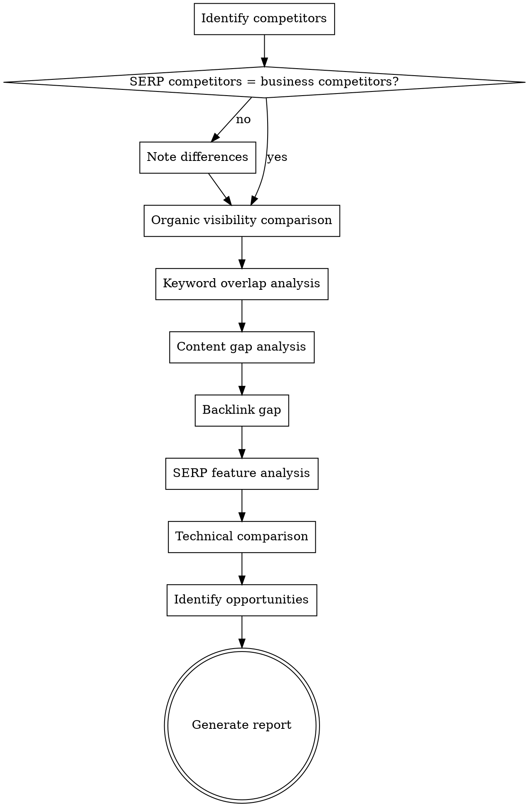

# Competitor Analysis

## Overview

Analyze who you're actually competing against in search, where the gaps and opportunities are, and how to differentiate. SERP competitors often differ from business competitors — this skill identifies both and finds actionable gaps.


## The Iron Law

```
YOUR COMPETITORS ARE WHO GOOGLE SAYS THEY ARE, NOT WHO YOU THINK THEY ARE.
```

Check the actual SERPs. The site that outranks you for your target keywords is your competitor — even if you've never heard of them. Analyzing only the companies you consider "competitors" is working blind.

## Checklist

You MUST create a task for each of these items and complete them in order:

1. **Identify competitors** — Direct business competitors + SERP competitors (may differ)
2. **Organic visibility comparison** — Estimated traffic, keyword count, visibility trends
3. **Keyword overlap analysis** — Shared keywords, unique keywords per competitor, gap opportunities
4. **Content gap analysis** — Topics competitors cover that you don't, content depth comparison
5. **Backlink gap** — Domains linking to competitors but not you, shared links, unique link sources
6. **SERP feature analysis** — Who owns featured snippets, PAA, knowledge panels for target queries
7. **Technical comparison** — Site speed, mobile experience, structured data adoption (high-level)
8. **Identify opportunities** — Where competitors are weak, underserved topics, link prospects
9. **Generate competitive intelligence report** — Findings table + gap analysis + priority opportunities

## Process Flow



## SEO Plan Integration
**On start:** If `seo-plan.md` exists, read it. Use Strategy, Target Keywords, and Rules & Decisions for context.
**On completion:** Update the Competitors section with top competitors, keyword gaps, and link prospects. Append to Action Log. If file doesn't exist, don't create it.

## The Process

### Step 1: Identify competitors

Two types of competitors to identify:

**Business competitors:** Companies the user considers direct competitors (ask them).

**SERP competitors:** Sites that actually rank for target keywords. To identify:
- Take 5-10 target keywords and check who ranks in top 10 via WebSearch
- Note which domains appear most frequently
- These are the real SEO competitors, even if they're not direct business competitors

If user has tool exports (Ahrefs, SEMrush), ask for "Competing Domains" or "Organic Competitors" report.

### Step 2: Organic visibility comparison

For each competitor (3-5 max):
- Estimated organic traffic (from user's tool data)
- Number of ranking keywords
- Visibility trend (growing, stable, declining)
- Domain authority/rating comparison

If no tool data available, estimate relative visibility from SERP presence across target keywords.

Present as a comparison table.

### Step 3: Keyword overlap analysis

- **Shared keywords:** Keywords where both the user's site and competitors rank — direct competition
- **Competitor-only keywords:** Keywords where competitors rank but the user doesn't — gap opportunities
- **User-only keywords:** Keywords where only the user ranks — unique advantages to protect
- Focus on competitor-only keywords with commercial/transactional intent — these are the highest-value gaps

Data gathering:
- **Manual path:** Ask user for "Content Gap" or "Keyword Gap" export from their SEO tool
- **MCP path:** Use WebSearch for target keywords, note which competitors rank and the user doesn't

### Step 4: Content gap analysis

Go deeper than keywords — analyze content:
- What topics do competitors cover comprehensively that the user's site doesn't touch?
- Where do competitors have deeper, more authoritative content on shared topics?
- What content formats do competitors use? (Guides, tools, comparisons, data studies)
- Where is competitor content thin or outdated — these are opportunities

Use WebFetch to analyze competitor pages for key topics:
- Content depth (word count, subtopic coverage)
- Content freshness (publication/update dates)
- Content format (how-to, listicle, comparison, tool, calculator)

### Step 5: Backlink gap

- Domains linking to competitors but not to the user's site — these are proven link prospects
- Shared domains — links from sites that link to multiple competitors (industry directories, publications)
- Competitor unique links — high-authority domains linking only to one competitor

Data gathering:
- **Manual path (primary):** Ask user for "Link Intersect" or "Backlink Gap" export from Ahrefs/SEMrush
- **MCP path (limited):** Can estimate link profiles from SERP authority signals, but full backlink data requires tools

Classify link prospects by:
- Domain authority/relevance
- Link type (editorial, directory, resource, PR)
- Outreach feasibility

### Step 6: SERP feature analysis

For the top 10-20 target keywords, check via WebSearch:
- **Featured snippets:** Who owns them? What format (paragraph, list, table)?
- **People Also Ask:** What questions appear? Which competitors are cited?
- **Knowledge panels:** Is there brand/entity knowledge panel presence?
- **Video carousels:** Do videos appear? Who owns them?
- **AI Overviews:** Which sources are cited in AI-generated answers?
- **Local pack:** Does it appear? (Relevant if local business)

Identify features the user could realistically win.

### Step 7: Technical comparison

High-level technical comparison (not a full audit):
- **Site speed:** Use WebFetch to compare page load experience across competitors
- **Mobile experience:** Responsive, usable on mobile?
- **Structured data:** Which competitors use JSON-LD? What schema types?
- **Site structure:** URL structure, navigation depth, internal linking patterns

Flag areas where the user has a technical advantage or disadvantage.

### Step 8: Identify opportunities

Synthesize all findings into actionable opportunities:

| Opportunity Type | What to Look For |
|-----------------|------------------|
| **Keyword gaps** | High-value keywords competitors rank for but you don't |
| **Content gaps** | Topics competitors cover that you don't touch |
| **Weak competitor content** | Topics where competitor content is thin, outdated, or poorly optimized |
| **SERP feature opportunities** | Featured snippets and PAA you could realistically win |
| **Link prospects** | Domains linking to competitors that could link to you |
| **Technical advantages** | Areas where you're technically superior — leverage this |

Prioritize by: impact (traffic/revenue potential) × feasibility (resources needed, competition level).

### Step 9: Generate competitive intelligence report

Output format:

**Executive Summary** — 3-5 sentences: competitive position, biggest gaps, biggest opportunities.

**Competitor Overview:**

| Competitor | Est. Traffic | Keywords | DA/DR | Trend | Key Strength |
|-----------|-------------|----------|-------|-------|-------------|
| ... | ... | ... | ... | ↑/↓/→ | ... |

**Gap Analysis:**
- Top 10 keyword gaps (highest value keywords you're missing)
- Top 5 content gaps (topics to build out)
- Top 10 link prospects (from backlink gap)

**SERP Feature Opportunities:**
- Features you can win, with the specific query and current owner

**Priority Actions:**
1. Immediate: Quick wins from gap analysis
2. Short-term: Content to create targeting key gaps
3. Long-term: Authority building and link acquisition

## Red Flags - STOP and Follow Process

If you catch yourself:
- Analyzing only business competitors without checking who actually ranks — you're working blind
- Producing a competitor comparison without actionable gaps — you've made a spreadsheet, not analysis
- Skipping the backlink gap because "we know we need more links" — you don't know WHERE to get them
- Comparing vanity metrics (total traffic, total keywords) without examining what keywords they have that you don't — comparisons without gaps aren't useful
- Not checking SERP features — you're ignoring half the competitive landscape

## Common Rationalizations

| Excuse | Reality |
|--------|---------|
| "We know who our competitors are" | Your business competitors and SERP competitors are often different. Check who actually ranks. |
| "We just need to see their backlinks" | Backlinks without content gaps and keyword gaps is one-third of the picture. |
| "They have higher DA, we can't compete" | DA is a tool metric, not a Google metric. Sites with lower DA outrank higher DA sites every day. |
| "Let's just copy what they're doing" | Copying creates parity, not advantage. Find where they're WEAK. |
| "We don't need to analyze their content" | Keywords tell you what they rank for. Content analysis tells you WHY and where they're vulnerable. |

## Key Principles

- SERP competitors ≠ business competitors — always check who actually ranks, not just who you think your competitors are
- Focus on actionable gaps, not vanity comparisons — "they have 10x more backlinks" is not actionable; "they rank for 50 keywords you don't target" is
- Competitor weaknesses are your opportunities — thin content, slow pages, missing schema
- Don't try to beat everyone at everything — focus on gaps where you can realistically compete
- Competitive analysis is a snapshot — revisit quarterly as the landscape shifts
