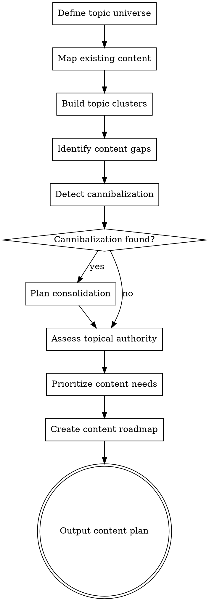

# Content Coverage

## Overview

Content strategy workflow for building topical authority. Inventories existing content, maps topic clusters, identifies gaps and cannibalization, and produces a prioritized content roadmap. The goal is comprehensive coverage of a topic, not just individual pages.


## The Iron Law

```
TOPICAL AUTHORITY IS BUILT PAGE BY PAGE. THERE ARE NO SHORTCUTS TO COMPREHENSIVE COVERAGE.
```

Publishing 30 thin pages on a topic doesn't build authority. Publishing 10 deeply useful pages that interlink and cover the topic from every angle does. Depth and structure beat volume every time.

## Checklist

You MUST create a task for each of these items and complete them in order:

1. **Define topic universe** — Core topics from keyword research or business focus areas
2. **Map existing content** — Inventory current pages, their target keywords, and coverage depth
3. **Build topic clusters** — Pillar pages + supporting content, internal link structure
4. **Identify content gaps** — Topics with no coverage, thin coverage, or outdated content
5. **Detect cannibalization** — Multiple pages targeting the same keyword/intent
6. **Assess topical authority** — Depth and breadth of coverage per topic vs competitors
7. **Prioritize content needs** — New content, updates, consolidation, pruning
8. **Create content roadmap** — Ordered list of content to create/update with target keywords and format
9. **Output content plan** — Content calendar with topics, keywords, format, priority, estimated impact

## Process Flow



## SEO Plan Integration
**On start:** If `seo-plan.md` exists, read it. Use Strategy, Target Keywords, and Competitors for context.
**On completion:** Update the Content Plan section with prioritized content actions and cannibalization notes. Append to Action Log. If file doesn't exist, don't create it.

## The Process

### Step 1: Define topic universe

- Identify the 3-7 core topics the site should own
- These come from: keyword research output, business focus areas, or user input
- Each core topic becomes a potential pillar cluster
- If `seo-superpowers:keyword-research` has been run, use those clusters as the topic universe

Ask the user: "What are the core topics your site should be THE authority on?"

### Step 2: Map existing content

Inventory all existing content:
- URL, title, target keyword (if known), word count, last updated date
- Content type: blog post, product page, category page, landing page, guide, tool
- Current organic traffic and rankings (if analytics data available)

Data gathering:
- **Sitemap:** Fetch XML sitemap via WebFetch for URL inventory
- **WebFetch:** Spot-check representative pages per section for content depth
- **User data:** Ask for CMS export, Screaming Frog crawl, or analytics export of all pages with organic traffic

### Step 3: Build topic clusters

For each core topic, design a cluster:
- **Pillar page:** Broad, comprehensive page covering the main topic (2000+ words typically)
- **Supporting pages:** Specific subtopics that link back to the pillar
- **Internal link structure:** Every supporting page links to the pillar; pillar links to all supporting pages

Example cluster:
```
Pillar: "Complete Guide to Email Marketing"
├── "Email Marketing for E-commerce"
├── "How to Write Email Subject Lines"
├── "Email Automation Workflows"
├── "Email List Building Strategies"
├── "Email Marketing Metrics to Track"
└── "Best Email Marketing Tools 2025"
```

Map existing content to clusters — which pages already fill cluster slots?

### Step 4: Identify content gaps

For each cluster, identify:
- **Missing topics:** Cluster slots with no existing content
- **Thin coverage:** Existing pages that are too shallow (< 500 words on a topic that needs depth)
- **Outdated content:** Pages that haven't been updated in 12+ months with dated information
- **Format gaps:** Topics where competitors use a format you don't (calculators, tools, comparisons)
- **Competitor coverage:** Use WebSearch or WebFetch to check what subtopics top competitors cover

### Step 5: Detect cannibalization

Cannibalization = multiple pages competing for the same keyword/intent.

Detection methods:
- Search `site:domain.com "keyword"` via WebSearch — do multiple pages appear?
- Check GSC data: do multiple URLs get impressions for the same query?
- Map target keywords to pages — any keyword assigned to 2+ pages?

For each cannibalization instance:
- Which page is stronger? (More traffic, more links, better content)
- **Consolidate:** Merge content into the stronger page, 301 redirect the weaker one
- **Differentiate:** Refocus the weaker page on a different intent or subtopic
- **Canonical:** If pages serve different purposes (e.g., product vs blog), use canonical only if true duplicates

### Step 6: Assess topical authority

For each core topic:
- How many pages cover this topic on your site vs top competitors?
- How deep is your coverage vs competitors? (Depth = subtopic coverage, not just word count)
- Are you covering the full intent spectrum? (Informational + commercial + transactional)
- Do you have supporting assets? (Tools, data, original research, expert content)

Rate each topic: Strong / Moderate / Weak authority — this informs prioritization.

### Step 7: Prioritize content needs

Four types of content actions, prioritized:

| Priority | Action | When |
|----------|--------|------|
| 1 | **Fix cannibalization** | Multiple pages competing — immediate negative impact |
| 2 | **Update high-traffic declining pages** | Existing traffic at risk — protect what you have |
| 3 | **Fill high-impact gaps** | Missing content for high-volume/high-intent keywords |
| 4 | **Create new cluster content** | Build out weak topic clusters |
| 5 | **Prune or consolidate** | Remove/merge pages that add no value |

### Step 8: Create content roadmap

For each content action, specify:
- **Page:** Existing URL to update or "NEW" for new content
- **Topic/keyword:** Primary keyword and supporting keywords
- **Content type:** Blog post, guide, comparison, tool, product page
- **Action:** Create, update, consolidate, redirect, prune
- **Word count target:** Based on competitive analysis
- **Internal linking:** Which pillar/supporting pages to link to/from
- **Priority:** 1 (immediate) through 5 (backlog)

### Step 9: Output content plan

**Content Calendar:**

| Priority | Action | Page/Topic | Target Keyword | Format | Word Count | Internal Links | Est. Impact |
|----------|--------|-----------|----------------|--------|------------|----------------|-------------|
| 1 | Fix cannibalization | /page-a + /page-b → /page-a | "keyword" | Consolidation | 2500 | Link from pillar | Protect existing traffic |
| 2 | Update | /existing-guide | "keyword" | Guide | 3000 | Add 5 internal links | Recover declining traffic |
| 3 | Create | NEW | "keyword" | How-to | 2000 | Link to/from pillar | +500 sessions/mo est. |

**Cluster Map** — Visual or table representation of each topic cluster showing pillar + supporting pages with status (exists/needs update/needs creation).

**Quick Wins** — Content updates that can be done in under 2 hours with high expected impact.

## Red Flags - STOP and Follow Process

If you catch yourself:
- Creating a content plan without auditing existing content first — you'll create duplicates
- Building topic clusters without checking for cannibalization — you might make it worse
- Planning new content before updating declining pages — you're ignoring your best assets
- Measuring coverage by page count instead of topic depth — quantity isn't authority
- Skipping the competitive content comparison — you're planning in a vacuum

## Common Rationalizations

| Excuse | Reality |
|--------|---------|
| "We just need more content" | More thin content makes things worse. You might need fewer, better pages. |
| "Cannibalization isn't a real problem for us" | If you haven't checked, you don't know. Most sites with 50+ pages have cannibalization. |
| "Our content is fine, we just need new topics" | Have you checked content depth vs competitors? "Fine" isn't an assessment. |
| "Let's skip the audit and start writing" | Without an audit, you'll create content you already have or should have consolidated. |
| "We don't have time to update old content" | Updating an existing page with traffic takes less time and has more impact than writing from scratch. |

## Key Principles

- Topical authority > individual page optimization — covering a topic comprehensively matters more than any single page
- Cannibalization is common and costly — always check before creating new content
- Prune before you publish — sometimes removing/consolidating weak content improves the whole site
- Content format matters — match format to intent (how-to → guide, comparison → table, etc.)
- Update before create — refreshing existing content is often higher ROI than writing from scratch
