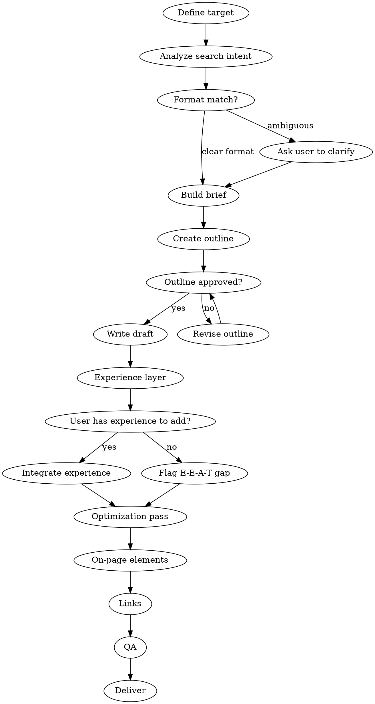

# Content Writing

## Overview

End-to-end SEO content writing workflow. Takes a topic or keyword and produces a publication-ready draft with proper structure, intent match, semantic coverage, and E-E-A-T signals. Covers the full pipeline: research → brief → outline → draft → optimization.

This skill is for **creating new content**. For optimizing existing pages, use `seo-superpowers:content-optimization`. For planning what content to create, use `seo-superpowers:content-coverage`.

## The Iron Law

```
MATCH INTENT OR NOTHING ELSE MATTERS.
```

If the SERP expects a how-to guide and you write a listicle, no amount of keyword optimization will save it. Before writing a single word, confirm the content format matches what Google already rewards for this query.

## Checklist

You MUST create a task for each of these items and complete them in order:

1. **Define the target** — Primary keyword, secondary keywords, audience, business goal
2. **Analyze search intent** — Classify intent, analyze top SERP results, determine expected format
3. **Build the content brief** — SERP intelligence, competitor gaps, specifications, link map
4. **Create heading-level outline** — H2/H3 structure mapped to subtopics and questions
5. **Write the draft** — Section by section, following the outline and intent
6. **Add the experience layer** — First-hand signals, examples, original data, unique perspective
7. **Optimization pass** — Keyword placement, readability, formatting, snippet targeting
8. **On-page SEO elements** — Title tag, meta description, URL slug, image alt text
9. **Internal and external links** — Link mapping, anchor text, source citations
10. **Quality assurance** — Fact-check, E-E-A-T review, final proofread
11. **Deliver the content package** — Final draft with all SEO elements and publishing notes

## Process Flow



## The Process

### Step 1: Define the target

Ask the user:
- What is the **primary keyword**? (If unknown, route to `seo-superpowers:keyword-research`)
- What are **secondary keywords**? (Related terms, long-tail variations, synonyms — aim for 5-10)
- Who is the **target audience**? (Demographics, knowledge level, pain points)
- What is the **business goal**? (Organic traffic, conversions, link magnet, thought leadership)
- What **tone and voice** should the content have?
- Any **brand style guidelines** to follow?

### Step 2: Analyze search intent

This step determines everything that follows. Get it wrong and the content will not rank.

- **Classify the intent:** Informational, navigational, commercial, or transactional
- **Search the SERP** (use WebSearch for the primary keyword):
  - What content format dominates? (How-to guide, listicle, comparison, deep-dive, product page)
  - What SERP features are present? (Featured snippets, People Also Ask, video carousel, image pack)
  - What is the average word count of top 5 results?
  - What subtopics do top results consistently cover?
- **Determine the expected format** — This is non-negotiable. Match it.

If the format is ambiguous, present options to the user with evidence from the SERP.

### Step 3: Build the content brief

The brief is the critical artifact. A thorough brief prevents most failure modes.

**Strategic Context:**
- Primary keyword with search volume and difficulty (if available)
- Secondary keywords (5-10)
- Search intent classification
- Target audience and their pain points
- Business goal for this piece

**SERP Intelligence:**
- Top 5 competing URLs with notes on strengths and weaknesses
- Content format that dominates the SERP
- SERP features present and which are targetable
- Average word count of top-ranking content

**Content Specifications:**
- Target word count range (based on competitor analysis)
- Required subtopics that top results consistently cover
- Content gaps — topics competitors miss (this is your differentiation)
- Specific questions from People Also Ask to address
- Target reading level appropriate for the audience

**Link Map:**
- Internal pages to link to (3-8, ask user for their sitemap or key pages)
- External sources to cite or reference
- Pages that should link back to this content after publishing

### Step 4: Create heading-level outline

Build the full H2/H3 structure before writing. This is a checkpoint — get user approval before proceeding.

Rules for the outline:
- **H1:** One per page. Contains primary keyword. Matches search intent.
- **H2s:** Each addresses a distinct subtopic or user question. Cover all required subtopics from the brief.
- **H3s:** Break down specifics within each H2 section.
- **Logical flow:** The outline should tell a complete story read top to bottom.
- **Question-based headings:** Where natural, phrase H2s as questions (improves featured snippet eligibility).
- **Gap headings:** Include at least one H2 that covers a topic competitors miss.

Present the outline to the user. Do not proceed to writing until the outline is approved.

### Step 5: Write the draft

Write section by section, following the approved outline.

**Opening (first 100 words):**
- Answer the primary query immediately — no preamble, no "In today's world..."
- Use the inverted pyramid: most important information first
- Include the primary keyword naturally

**Body sections:**
- Short paragraphs (2-3 sentences max)
- One idea per paragraph
- Use the **pain-point structure** where applicable:
  1. Name the specific problem the reader has
  2. Explain why solutions they have tried do not work
  3. Present the better approach with evidence
- Include concrete examples, not abstract advice
- Use transition sentences between sections

**Formatting for scannability:**
- Bold key phrases and takeaways
- Use bullet lists for collections of items
- Use numbered lists for sequential steps
- Use tables for comparisons or structured data
- Break up text with subheadings every 200-300 words

**Conclusion:**
- Summarize key takeaways (not just repeat the intro)
- Include a clear next step or call-to-action
- Link to related content on the site

### Step 6: Add the experience layer

This is what separates ranking content from generic output. Ask the user for:

- **First-hand anecdotes:** "In our experience...", "When we tested...", "I've found..."
- **Original data:** Screenshots, test results, proprietary metrics, case studies
- **Specific examples:** Replace any generic example with a real, concrete one
- **Unique perspective:** What does the author know that competitors don't cover?
- **Expert quotes:** Can the user provide quotes from subject matter experts?

If the user cannot provide experience signals, flag this as an E-E-A-T gap in the final output. The content can still be published, but it will be at a disadvantage against competitors who demonstrate experience.

### Step 7: Optimization pass

**Keyword placement check:**
- Primary keyword in: title tag, H1, first 100 words, at least one H2, URL slug, meta description
- Secondary keywords distributed naturally across H2s and body
- No keyword stuffing — if it reads awkwardly, rewrite

**Readability:**
- Target Flesch reading ease of 60+ for general audiences (adjust for technical content)
- Short sentences (under 20 words on average)
- Active voice preferred
- Read aloud — if it sounds unnatural, rewrite
- Avoid jargon unless the audience expects it

**Featured snippet targeting:**
- For definition queries: Write a concise 40-50 word answer directly after the question heading
- For how-to queries: Use numbered step lists under H2/H3 headings
- For comparison queries: Use clean HTML tables with clear headers
- For list queries: Use H2/H3 headings that Google can extract as list items

### Step 8: On-page SEO elements

Provide exact recommendations:

- **Title tag:** Under 60 characters. Primary keyword near the front. Compelling — include a value hook, number, or emotional trigger.
- **Meta description:** Under 155 characters. Includes primary keyword. Has a call-to-action verb. Makes the reader want to click.
- **URL slug:** Short, hyphenated, keyword-included, no dates, no stop words.
- **Image alt text:** Descriptive, includes keyword where natural, not stuffed.
- **Structured data:** Recommend appropriate schema (Article, HowTo, FAQ, etc.) based on content type.

### Step 9: Internal and external links

- **Internal links (3-8):** Link to relevant existing pages with descriptive anchor text (not "click here"). Place links within contextually relevant paragraphs, not just lists.
- **External links:** Cite credible sources for statistics, claims, and references. Link to authoritative domains. This builds trust.
- **Anchor text:** Vary anchor text. Use descriptive phrases that tell the reader what they will find.

Ask the user which pages on their site are most relevant for internal linking.

### Step 10: Quality assurance

Final checks before delivery:

- **Fact-check:** Verify all statistics, claims, and dates. Flag any that could not be verified.
- **E-E-A-T review:** Does the content demonstrate Experience, Expertise, Authoritativeness, Trustworthiness? Where is it weakest?
- **Completeness:** Does the content satisfy the search intent fully? Would a reader feel done after reading?
- **Originality:** Does the content add value beyond what already ranks, or is it just a rewrite of existing content?
- **Proofread:** Grammar, spelling, consistency, formatting.
- **Mobile readability:** Short paragraphs, no wide tables, scannable on small screens.

### Step 11: Deliver the content package

Output format:

**Content Brief Summary:**
- Target keyword, intent, format, word count
- Key differentiation angle

**SEO Elements:**
- **Title tag:** `[exact title]`
- **Meta description:** `[exact meta description]`
- **URL slug:** `[exact slug]`
- **Schema type:** `[recommended schema]`

**The Content:**
- Full draft with heading structure
- Bold formatting, lists, and tables included
- Internal link placements marked: `[internal link: anchor text → /target-url]`
- External link placements marked: `[external link: anchor text → source-url]`
- Image placement suggestions: `[IMAGE: description of what image should show]`

**E-E-A-T Assessment:**
- Experience signals present: [list]
- Experience gaps to address: [list]
- Author bio recommendation

**Publishing Notes:**
- Recommended publish date (if seasonal relevance)
- Pages to update with links to this new content
- Content refresh schedule (when to revisit)

**Next Steps:**
- Suggest `seo-superpowers:content-optimization` for post-publish optimization
- Suggest `seo-superpowers:analytics-review` for performance monitoring after 2-4 weeks

## Red Flags - STOP and Follow Process

If you catch yourself:
- Writing without completing the SERP intent analysis — you are guessing the format
- Producing an outline without user approval — you will waste effort on the wrong structure
- Writing generic content without asking for experience signals — you are creating commodity content
- Stuffing keywords until the text reads unnaturally — rewrite for humans first
- Skipping the content brief — you are writing without direction
- Writing a 3000-word article when the SERP rewards 800-word focused answers — match the SERP
- Starting with "In today's digital landscape..." or similar filler openings — answer the query immediately

## Common Rationalizations

| Excuse | Reality |
|--------|---------|
| "We don't need a brief, let's just write" | The brief is 40% of the work. Skipping it means guessing. The research found writing is only 20% of the effort. |
| "Let's match the longest competitor" | Longer is not better. Match the depth needed to satisfy intent. If 800 words answers the query, 3000 words just add fluff. |
| "We'll add experience signals later" | Experience is not a garnish. It shapes the content. Retrofit experience reads as fake. Gather it before writing. |
| "The keyword density is too low" | Keyword density is not a ranking factor. Semantic coverage and intent match are. Write naturally. |
| "This topic doesn't need original research" | Every topic benefits from original perspective. If you have nothing new to add, why publish? |
| "Let's skip the outline and iterate on drafts" | Iterating on structure is 10x faster at the outline stage than at the draft stage. |
| "AI can write this faster without the process" | AI without process produces generic content that ranks nowhere. The process is what creates differentiation. |

## Key Principles

- Research and planning take more time than writing — this is correct and intentional
- Search intent match is the #1 success factor — get format wrong and nothing else matters
- The content brief is the critical handoff artifact — invest heavily in it
- Original experience is the moat against commodity content — always seek it
- Structure is a first-class concern — heading hierarchy, formatting, and snippet targeting are not afterthoughts
- Write for humans, optimize for machines — if advice hurts readability, reconsider
- Every piece of content should add something the SERP does not already have — otherwise why publish
- Present the outline for approval before writing — this is a mandatory checkpoint
