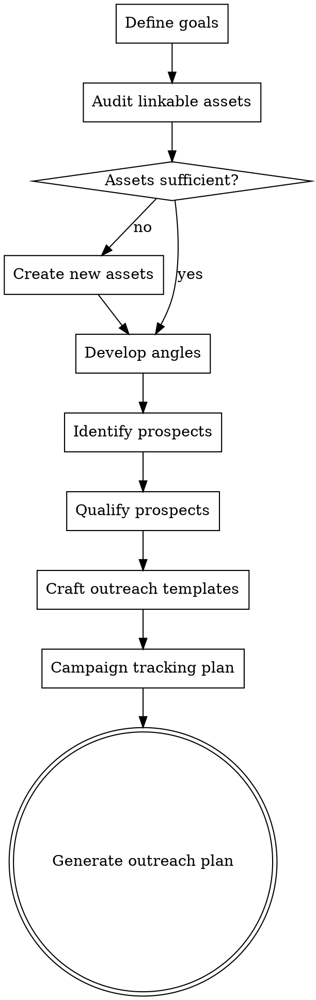

# Digital PR & Outreach

## Overview

Systematic approach to earning backlinks through content-driven outreach and digital PR. Moves from goal setting through asset creation, prospect identification, and outreach execution. Focuses on earning links by providing genuine value, not buying or spamming.


## The Iron Law

```
IF YOUR OUTREACH DOESN'T OFFER VALUE TO THE RECIPIENT, IT'S SPAM. NOT MARKETING.
```

"Hey, I noticed your article and thought you might want to link to my blog post" is not an outreach angle. It's a stranger asking for a favor. Every outreach email must answer: "What's in it for THEM?"

## Checklist

You MUST create a task for each of these items and complete them in order:

1. **Define goals** — Target domains, link types, volume goals
2. **Audit linkable assets** — What existing content is worth linking to? What needs to be created?
3. **Develop angles** — Data studies, original research, tools, expert roundups, newsjacking opportunities
4. **Identify prospects** — Journalists, bloggers, resource page owners in the niche
5. **Qualify prospects** — Domain authority, relevance, likelihood of linking, contact availability
6. **Craft outreach templates** — Personalized templates per prospect type, A/B test variations
7. **Track campaign** — Response rates, links earned, follow-up schedule
8. **Generate outreach plan** — Prioritized prospect list + angles + templates + timeline

## Process Flow



## The Process

### Step 1: Define goals

Establish clear, measurable goals:
- **Volume:** How many links per month/quarter?
- **Quality threshold:** Minimum DA/DR for target domains?
- **Link types:** Editorial, resource page, PR mention, guest contribution?
- **Target domains:** Specific dream publications or domains?
- **Timeline:** Campaign duration?
- **Budget:** Any budget for content creation, tools, or PR distribution?

Be realistic — 5-10 quality links per month is a strong result for most sites.

### Step 2: Audit linkable assets

Review existing content for link-worthiness:

| Asset Type | Link-Worthy? | Why People Link |
|-----------|-------------|-----------------|
| **Original research/data** | High | Unique data others want to cite |
| **Comprehensive guides** | Medium-High | Reference material for related content |
| **Free tools/calculators** | High | Practical value, ongoing utility |
| **Infographics/visual data** | Medium | Easy to embed and share |
| **Expert roundups** | Medium | Participants share and link |
| **Case studies** | Medium | Evidence for others' arguments |
| **Standard blog posts** | Low | Unless uniquely valuable |
| **Product pages** | Low | Rarely link-worthy on their own |

Identify: What do you have? What's your strongest linkable asset? What's missing?

### Step 3: Develop angles

For each target asset, develop outreach angles:

**Data-driven PR:**
- Original surveys or studies with newsworthy findings
- Industry benchmarks or annual reports
- Data visualization of publicly available data with unique analysis

**Resource-based:**
- Comprehensive guides that deserve "recommended resource" placement
- Free tools that solve a real problem
- Templates or frameworks others can use

**Newsjacking:**
- Rapid expert commentary on industry news
- Data or analysis related to trending topics
- Contrarian or novel perspectives on current events

**Relationship-based:**
- Expert contributions to roundups or collaborative content
- Guest posts on relevant publications (with genuine expertise)
- Partnerships with complementary businesses

For each angle, define: What's the hook? Why would someone link to this? What value does the prospect get?

### Step 4: Identify prospects

Find potential link sources:

**Methods:**
- **Competitor backlinks:** Sites linking to competitors but not you (from `seo-superpowers:link-analysis`)
- **Resource pages:** Search `"resources" + [topic]`, `"useful links" + [topic]` via WebSearch
- **Journalists:** Search for bylines covering your industry
- **Bloggers:** Identify active bloggers in the niche via WebSearch
- **Broken links:** Find competitors' dead pages still receiving backlinks — you can replace them

**For each prospect, record:**
- Domain and specific page URL
- Contact person (author, editor, webmaster)
- Domain authority/rating
- Relevance to your topic
- Link type opportunity (editorial, resource, mention)

### Step 5: Qualify prospects

Score each prospect before outreach:

| Criteria | Weight | How to Assess |
|----------|--------|---------------|
| **Domain authority** | Medium | DA/DR from tool data |
| **Relevance** | High | Is the site in the same niche/topic? |
| **Link likelihood** | High | Do they link out regularly? Is there a clear fit? |
| **Traffic** | Medium | Does the site have real traffic? (Not a dead blog) |
| **Contact available** | Medium | Can you find a real person to contact? |
| **Editorial quality** | Medium | Is the site well-maintained and credible? |

Remove prospects that are:
- Clearly paid link schemes or link farms
- Irrelevant to your topic
- Dead or abandoned sites
- No contact information available

### Step 6: Craft outreach templates

Create personalized templates per prospect type. Key principles:

**Subject line:**
- Short, specific, no clickbait
- Reference their content or interest
- Example: "Data for your [topic] article" not "Link exchange opportunity!!"

**Email body:**
- Lead with value — what's in it for THEM
- Reference specific content of theirs (proves you've read it)
- Explain what you have and why it's relevant to their audience
- Keep it under 150 words
- No attachments on first contact
- Clear, simple ask

**Template types:**
- **Resource page:** "I noticed your [topic] resource page — we have [asset] that your readers might find useful"
- **Broken link:** "I found a broken link on your [page] — we have a similar resource that could replace it"
- **Data/research:** "We published [study] with findings about [topic] that might be relevant to your coverage"
- **Expert source:** "I'm [name/role] at [company] — available for expert commentary on [topic]"

Create 2 variations per template type for A/B testing.

### Step 7: Track campaign

Define tracking process:
- **Prospect status:** Not contacted, contacted, responded, follow-up, link earned, declined
- **Response rate:** Track per template variation
- **Follow-up schedule:** Follow up after 5-7 days if no response (maximum 2 follow-ups)
- **Links earned:** Track date, domain, page, anchor text, link type
- **ROI:** Links earned vs time/money invested

### Step 8: Generate outreach plan

Output format:

**Campaign Summary:**
- Goal: X links in Y time period
- Assets: [list of linkable assets with URLs]
- Primary angles: [list of outreach angles]

**Prospect List:**

| Priority | Domain | DA/DR | Contact | Angle | Template | Status |
|----------|--------|-------|---------|-------|----------|--------|
| 1 | ... | ... | ... | Data study | Research template v1 | Not contacted |
| 2 | ... | ... | ... | Resource page | Resource template v1 | Not contacted |

**Outreach Templates:**
- Template A (resource page): [full template text]
- Template B (data study): [full template text]
- Follow-up template: [full template text]

**Timeline:**
- Week 1: Send first batch (20 prospects)
- Week 2: Follow up on week 1, send batch 2
- Week 3: Follow up on week 2, send batch 3
- Week 4: Assess results, refine approach

**Success Metrics:**
- Target response rate: 10-15%
- Target link conversion rate: 3-5% of outreach
- Links earned per month: [target]

## Red Flags - STOP and Follow Process

If you catch yourself:
- Sending the same template to 500 people — that's spam, and your domain reputation will pay for it
- Asking for links without offering anything in return — why would they link to you?
- Starting outreach before you have a genuinely linkable asset — "link to my blog post" is not an angle
- Skipping prospect qualification — emailing dead blogs and link farms wastes time and reputation
- Not tracking results — you can't improve what you don't measure

## Common Rationalizations

| Excuse | Reality |
|--------|---------|
| "Volume is how outreach works" | 20 personalized emails with 15% response rate beat 200 templates with 1% response rate. And your domain reputation survives. |
| "Everyone buys links" | Many do. Most regret it. Google gets better at detecting purchased links every year. |
| "We don't have time to personalize" | If you don't have time to personalize, you don't have time to do outreach properly. Do fewer, better. |
| "Our content is good enough to link to" | Then why aren't people linking to it already? Good content is necessary but not sufficient. You need an angle. |
| "Guest posts are dead" | Low-quality guest posting on link farms is dead. Expert contributions to relevant publications still work. |

## Key Principles

- Earn links, don't buy them — sustainable link building is content-driven
- Personalization > volume — 20 thoughtful outreach emails beat 200 spam emails
- The content must be genuinely useful/interesting — "link to my blog post" is not an angle
- Provide value first — every outreach should offer something to the prospect
- Follow up respectfully — 2 follow-ups max, always polite, accept "no" gracefully
- Track everything — data-driven iteration improves results over time
