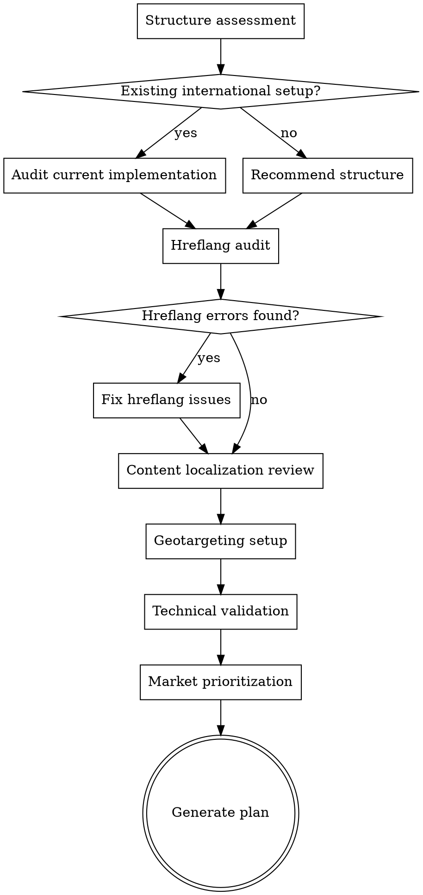

# International SEO

## Overview

Optimize a website for multiple countries and/or languages. Covers the three key decisions: URL structure, hreflang implementation, and content localization. International SEO mistakes are among the hardest to diagnose and fix — this skill provides a systematic approach.


## The Iron Law

```
TRANSLATION IS NOT LOCALIZATION. IF YOU DIDN'T DO LOCAL KEYWORD RESEARCH, YOU DIDN'T LOCALIZE.
```

Running your content through a translator and calling it "international SEO" is how you end up targeting keywords nobody in that market actually searches for. Local users search differently — research their language, not just translate yours.

## Checklist

You MUST create a task for each of these items and complete them in order:

1. **Structure assessment** — ccTLD vs subfolder vs subdomain analysis with trade-offs
2. **Hreflang audit** — Implementation correctness, return tags, x-default, common errors
3. **Content localization review** — Translation quality, cultural adaptation, local keyword research
4. **Geotargeting setup** — GSC international targeting, server location, CDN configuration
5. **Technical validation** — Canonical tags across languages, indexation per market, sitemap per language
6. **Market prioritization** — Which markets to focus on based on opportunity vs effort
7. **Generate international SEO plan** — Structure recommendation + hreflang implementation guide + market roadmap

## Process Flow



## The Process

### Step 1: Structure assessment

Three options for URL structure. Evaluate for this specific case:

| Structure | Example | Pros | Cons |
|-----------|---------|------|------|
| **ccTLD** | example.de, example.fr | Strongest geo signal, clear brand per market | Separate domain authority, expensive, complex management |
| **Subfolder** | example.com/de/, example.com/fr/ | Consolidates domain authority, easy to manage | Weaker geo signal than ccTLD, single domain risk |
| **Subdomain** | de.example.com, fr.example.com | Separate hosting possible, moderate geo signal | Split domain authority, more complex than subfolders |

**Recommendation framework:**
- Small/medium business or starting international → **Subfolders** (consolidate authority)
- Large brand with per-market teams and budgets → **ccTLDs** (strongest targeting)
- Subdomains → Rarely the best choice (worst of both worlds)

Ask the user about their current setup, technical constraints, and scale.

### Step 2: Hreflang audit

Hreflang tells Google which language/country version to show. Common errors:

**Implementation check:**
- Hreflang tags present? (Check HTML head, HTTP headers, or XML sitemap)
- Correct format? `hreflang="en-US"` (language-country, ISO 639-1 + ISO 3166-1)
- **Return tags:** Every hreflang annotation must have a return tag on the target page. If page A says "my French version is page B", then page B must say "my English version is page A". Missing return tags are the #1 hreflang error.
- **x-default:** Is there an x-default for users who don't match any specified version?
- **Self-referencing:** Each page should include a hreflang pointing to itself
- **Consistency:** Hreflang URLs match canonical URLs exactly

**Common errors:**

| Error | Detection | Fix |
|-------|-----------|-----|
| Missing return tags | Page A references B, but B doesn't reference A | Add bidirectional references |
| Wrong language codes | `hreflang="uk"` instead of `hreflang="en-GB"` | Use ISO 639-1 language + ISO 3166-1 country |
| Pointing to non-canonical URLs | Hreflang URL differs from canonical | Align hreflang with canonical URLs |
| Missing x-default | No fallback for unmatched users | Add x-default pointing to most general version |
| Hreflang on noindex pages | Conflicting signals | Remove hreflang or remove noindex |
| Wrong implementation location | Mixed methods (some in HTML, some in sitemap) | Use one consistent method |

Use WebFetch to check hreflang implementation on key pages.

### Step 3: Content localization review

Translation ≠ localization. Assess:

**Translation quality:**
- Professional translation or machine-translated?
- Does content read naturally in the target language?
- Are there untranslated strings, navigation, or UI elements?
- Are dates, currencies, phone numbers, addresses localized?

**Cultural adaptation:**
- Are examples, references, and imagery culturally appropriate?
- Are local regulations/standards reflected (GDPR for EU, etc.)?
- Does the tone match local expectations?

**Local keyword research:**
- Direct translations of keywords often have different search volume or intent
- Target-language users search differently — research local search terms
- Use `seo-superpowers:keyword-research` for each target market

**Content coverage per market:**
- Does each market version have equivalent content depth?
- Are there market-specific pages (local case studies, local pricing, local regulations)?
- Is there thin or auto-generated content on international pages?

### Step 4: Geotargeting setup

- **GSC International Targeting:** Set target country in Google Search Console (for subfolders/subdomains, not ccTLDs)
- **Server location/CDN:** Serve content from geographically close servers via CDN
- **IP detection:** If used, provide a way to override (language selector) — don't force redirect based on IP
- **Language selector:** Visible on all pages, links to the correct language version (not just homepage)

### Step 5: Technical validation

Per-market technical checks:
- **Canonical tags:** Each language version has self-referencing canonical (not pointing to the "main" language)
- **Indexation:** Check indexed pages per market in GSC (separate property per subdomain/ccTLD, or URL prefix for subfolders)
- **Sitemap:** One sitemap per language or hreflang annotations in sitemap — submitted per market
- **Robots.txt:** No unintentional blocking of international versions
- **Rendering:** International pages render correctly (especially for RTL languages like Arabic, Hebrew)
- **Page speed:** International versions load fast (CDN, local assets)

### Step 6: Market prioritization

Not all markets deserve equal investment. Prioritize by:

| Factor | Assessment |
|--------|-----------|
| **Search demand** | Is there search volume in this market for your topics? |
| **Competition** | How strong are local competitors? |
| **Business fit** | Can you actually serve this market? (Shipping, support, legal) |
| **Current presence** | Do you already have traffic/rankings in this market? |
| **Content cost** | What does quality localization cost for this language? |
| **Revenue potential** | What's the revenue opportunity? |

Tier markets: Tier 1 (full investment), Tier 2 (moderate investment), Tier 3 (minimal/monitor).

### Step 7: Generate international SEO plan

Output format:

**Structure Recommendation:**
- Recommended approach (ccTLD/subfolder/subdomain) with reasoning
- Implementation steps if changing structure

**Hreflang Implementation Guide:**
- Correct hreflang tags for each language/country version
- Implementation method (HTML, HTTP header, or sitemap)
- Template code

**Market Roadmap:**

| Market | Tier | Structure | Content Status | Priority Actions |
|--------|------|-----------|---------------|-----------------|
| US (en) | 1 | /en/ (default) | Complete | Baseline |
| Germany (de) | 1 | /de/ | 80% translated | Complete localization, local KW research |
| France (fr) | 2 | /fr/ | 40% translated | Prioritize high-traffic pages |
| Japan (ja) | 3 | — | Not started | Monitor demand, pilot 10 pages |

**Technical Fixes:**
- Hreflang errors to fix (with exact code)
- Canonical tag corrections
- GSC targeting setup steps

## Red Flags - STOP and Follow Process

If you catch yourself:
- Auto-translating content and calling it localized — translated keywords often have zero search volume in the target market
- Implementing hreflang without checking return tags — one-directional hreflang doesn't work, and this is the #1 error
- Treating all markets with equal investment — you'll spread too thin and succeed nowhere
- Forcing redirects based on IP without a language selector — you'll trap users in the wrong language version
- Canonicalizing all language versions to the "main" language — each version needs its own self-referencing canonical

## Common Rationalizations

| Excuse | Reality |
|--------|---------|
| "Google Translate is good enough" | For understanding, maybe. For ranking in local search, absolutely not. Local users notice bad translations. |
| "English keywords work globally" | Even in English-speaking markets (US vs UK vs AU), search terms differ. "Trainers" vs "sneakers" vs "runners." |
| "We'll do proper localization later" | Auto-translated pages with wrong keywords can hurt your brand perception in that market permanently. |
| "Hreflang is too complicated" | It's complicated to get right. That's exactly why most competitors get it wrong — which is your opportunity. |
| "We just need to translate the top pages" | Partial translation with missing hreflang creates confusion. Start with one market done properly. |

## Key Principles

- Hreflang is hard — most implementations have errors. Audit carefully.
- Return tags are mandatory — one-directional hreflang doesn't work
- Translate content, don't just translate keywords — localization requires local keyword research
- Don't serve content based on IP alone — let users choose their language
- Consolidate authority when possible — subfolders beat subdomains for most businesses
- Not every market deserves full investment — prioritize based on opportunity and resources
