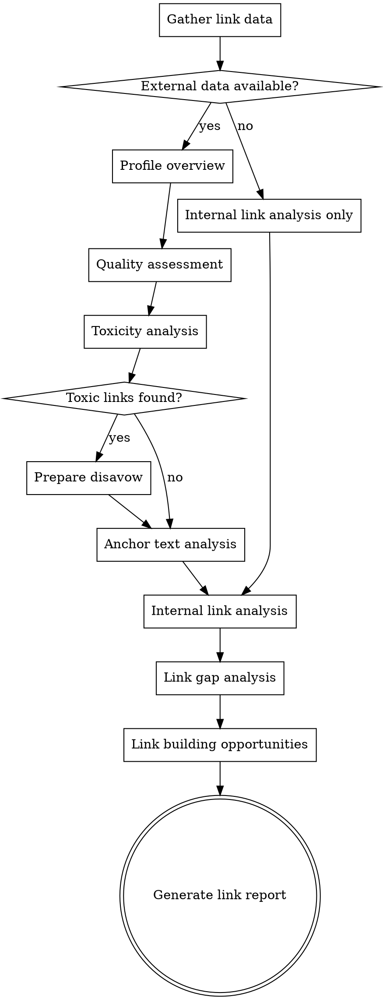

# Link Analysis

## Overview

Backlink profile evaluation and internal link audit. Assesses link quality, identifies toxic links, analyzes anchor text distribution, maps internal link structure, and finds link building opportunities. External link data requires tool exports — internal links can be analyzed via WebFetch.


## The Iron Law

```
ONE RELEVANT, AUTHORITATIVE LINK IS WORTH MORE THAN A THOUSAND SPAM LINKS. QUANTITY IS NOT A STRATEGY.
```

A healthy link profile looks natural — mostly mid-range domains, some high-authority, diverse anchor text. If the profile looks engineered, it probably was, and Google knows.

## Checklist

You MUST create a task for each of these items and complete them in order:

1. **Gather link data** — Get backlink export from user's tool of choice
2. **Profile overview** — Total referring domains, domain authority trend, link velocity
3. **Quality assessment** — Referring domain quality distribution, spam score, topical relevance
4. **Toxicity analysis** — Identify potentially harmful links: PBNs, paid links, irrelevant directories, foreign spam
5. **Anchor text analysis** — Distribution: branded, exact match, partial match, generic, URL. Flag over-optimization.
6. **Internal link analysis** — PageRank flow, orphan pages, deep pages, hub identification
7. **Link gap analysis** — Domains linking to competitors but not to the site
8. **Disavow recommendations** — If toxic links found, provide disavow file format
9. **Link building opportunities** — Prioritized list of prospect domains with outreach angles
10. **Generate link report** — Profile summary + findings table + priority actions

## Process Flow



## SEO Plan Integration
**On start:** If `seo-plan.md` exists, read it. Use Strategy and Competitors for context.
**On completion:** Update the Link Profile section with referring domains, toxicity, and anchor health summary. Append to Action Log. If file doesn't exist, don't create it.

## The Process

### Step 1: Gather link data

External backlink data requires SEO tool exports. Ask the user for:
- **Backlink export CSV** from Ahrefs, SEMrush, Moz, or Majestic
- **Columns needed:** Referring domain, referring URL, target URL, anchor text, domain rating/authority, follow/nofollow, first seen date, link type
- **Competitor backlink data** if available (for gap analysis)

For internal links:
- Can be gathered via WebFetch by crawling key pages
- User can also provide Screaming Frog internal link report

### Step 2: Profile overview

Summarize the backlink profile:
- Total backlinks and referring domains (unique domains matter more than total links)
- Domain authority/rating and trend over time
- Link velocity — rate of new links gained/lost per month
- Follow vs nofollow ratio
- Top linked pages — which pages attract the most links?

### Step 3: Quality assessment

Evaluate referring domain quality:
- **Distribution:** What percentage of referring domains are DR/DA 0-20, 20-40, 40-60, 60+?
- **Topical relevance:** Are linking sites in the same or related niche?
- **Geographic relevance:** Are links from relevant countries for the target market?
- **Link types:** Editorial, directory, forum, social, comment, sidebar/footer

A healthy profile has a natural distribution — mostly mid-range domains with some high-authority and some low-authority.

### Step 4: Toxicity analysis

Flag potentially harmful links:

| Red Flag | Indicator |
|----------|-----------|
| **PBNs (Private Blog Networks)** | Same IP, thin content, no real traffic, interlinked |
| **Paid links** | "sponsored" pages, site-wide footer/sidebar links, irrelevant anchor text |
| **Link farms** | Hundreds of outbound links, low-quality content, no editorial standards |
| **Foreign spam** | Links from irrelevant foreign-language sites, often pharma/gambling |
| **Irrelevant directories** | Low-quality directories with no editorial review |
| **Comment/forum spam** | Automated comment links, forum profile links |

Be conservative — not every low-quality link is toxic. Flag only genuinely harmful patterns.

### Step 5: Anchor text analysis

Analyze anchor text distribution:

| Type | Healthy Range | Risk Signal |
|------|--------------|-------------|
| **Branded** (company name, URL) | 30-50% | Too low may indicate manipulation |
| **Exact match** (target keyword) | 1-5% | >10% is over-optimization risk |
| **Partial match** (keyword variation) | 10-20% | Watch for patterns |
| **Generic** ("click here", "read more") | 10-20% | Natural component |
| **Naked URL** (https://...) | 10-20% | Natural component |
| **Other/random** | varies | Normal in natural profiles |

Flag if exact match anchor text is significantly above 5% — this is a common penalty trigger.

### Step 6: Internal link analysis

- **Hub pages:** Which pages have the most internal links pointing to them? Are these the right priority pages?
- **Orphan pages:** Pages with no internal links pointing to them — invisible to crawlers following links
- **Deep pages:** Pages requiring 4+ clicks from homepage to reach — consider flattening structure
- **Anchor text:** Are internal link anchors descriptive and keyword-relevant?
- **Link equity distribution:** Is link equity flowing to the most important pages?

Use WebFetch to crawl 10-20 key pages and map their internal link structure.

### Step 7: Link gap analysis

If competitor backlink data available:
- Identify domains linking to 2+ competitors but not to the user's site — high-probability prospects
- Identify domains linking to only 1 competitor — possible niche opportunities
- Classify prospects by: domain authority, relevance, link type, outreach feasibility

### Step 8: Disavow recommendations

Only if genuinely toxic links were identified in Step 4:
- Generate disavow file in Google's format
- Prefer domain-level disavow (`domain:spam-site.com`) over URL-level
- Include only genuinely harmful links — over-disavowing can hurt
- Remind user: disavow is a last resort, not routine maintenance

```
# Disavow file generated by link analysis
# [Date]
# Only genuinely harmful domains - review before submitting
domain:spam-site-1.com
domain:spam-site-2.com
```

### Step 9: Link building opportunities

Compile prioritized prospect list from:
- Link gap analysis (competitors' linking domains)
- Broken link opportunities (competitors' dead pages still receiving links)
- Resource page prospects (pages in the niche that curate resources)
- Content-driven prospects (publications and blogs that cover the topic)

For each prospect:
- Domain, DA/DR, relevance, link type opportunity
- Suggested outreach angle (what value can you offer them?)

### Step 10: Generate link report

Output format:

**Profile Summary:**

| Metric | Value | Assessment |
|--------|-------|------------|
| Referring domains | ... | ... |
| Domain rating/authority | ... | Trend: ↑/↓/→ |
| Link velocity | .../month | Healthy/Declining/Growing |
| Follow/nofollow ratio | .../... | Normal/Unusual |

**Anchor Text Distribution** — Table with percentages and risk flags

**Toxic Links** — List of domains to disavow (if any)

**Internal Link Issues** — Orphan pages, deep pages, equity distribution problems

**Link Building Opportunities** — Top 10-20 prospects ranked by potential impact

**Priority Actions:**
1. Disavow toxic links (if applicable)
2. Fix internal linking issues (orphan pages, equity flow)
3. Begin outreach to top prospects

## Red Flags - STOP and Follow Process

If you catch yourself:
- Disavowing every link under DA 30 — you're nuking your natural profile
- Ignoring internal links because "they're not real backlinks" — internal links are the most underused lever in SEO
- Fixating on total backlink count instead of referring domain quality — 500 links from 3 domains is not a strong profile
- Skipping anchor text analysis — over-optimized anchors are one of the most common penalty triggers
- Not checking the link gap — you're missing the most actionable part of the analysis

## Common Rationalizations

| Excuse | Reality |
|--------|---------|
| "We need more backlinks" | You might need better backlinks. Or you might need better internal links. Check the data first. |
| "Let's disavow everything suspicious" | Over-disavowing can hurt. Only disavow genuinely harmful patterns. |
| "DA/DR is all that matters" | Relevance matters as much as authority. A DA-30 site in your niche beats a DA-70 site in an unrelated industry. |
| "Internal links don't move the needle" | Internal links distribute PageRank to your priority pages. You control them completely. Use them. |
| "We'll just build more links to fix this" | If the existing profile is toxic or over-optimized, more links won't fix the problem. Clean house first. |

## Key Principles

- Quality over quantity — 10 relevant, authoritative links beat 1000 spam links
- Anchor text distribution should look natural — over-optimization is a ranking signal
- Internal links are the most underused lever — you control them completely
- Don't disavow aggressively — only genuinely harmful links, not just low-quality ones
- Link building is a long-term investment — sustainable strategies beat quick schemes
