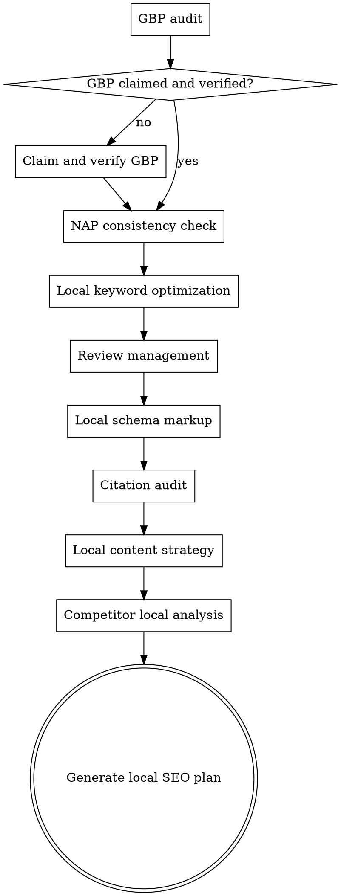

# Local SEO

## Overview

Optimize for local search visibility — Google Business Profile, local pack rankings, NAP consistency, citations, and reviews. Local SEO has its own ranking factors distinct from organic web rankings, centered on proximity, relevance, and prominence.


## The Iron Law

```
YOUR GOOGLE BUSINESS PROFILE IS YOUR LOCAL HOMEPAGE. IF IT'S INCOMPLETE, NOTHING ELSE MATTERS.
```

GBP is the foundation of local SEO. Optimizing your website for local keywords while your GBP has the wrong category, missing hours, and no photos is like running ads to a broken landing page. Fix the profile first.

## Checklist

You MUST create a task for each of these items and complete them in order:

1. **Google Business Profile audit** — Completeness, categories, attributes, photos, posts, Q&A
2. **NAP consistency check** — Name, address, phone number across web, directories, citations
3. **Local keyword optimization** — Location-modified keywords, service-area terms, "near me" variants
4. **Review management** — Review volume, rating, response strategy, review generation
5. **Local schema markup** — LocalBusiness schema, opening hours, service area, geo-coordinates
6. **Citation audit** — Key directories, consistency, completeness
7. **Local content strategy** — Location pages, local events, community content
8. **Competitor local analysis** — Who appears in local pack, their GBP completeness, review count
9. **Generate local SEO plan** — Priority actions + GBP optimization checklist + citation targets

## Process Flow



## The Process

### Step 1: Google Business Profile audit

The GBP is the most important local SEO asset. Audit for completeness:

| Element | Check | Priority |
|---------|-------|----------|
| **Business name** | Matches real-world name exactly (no keyword stuffing) | Critical |
| **Primary category** | Most specific relevant category selected | Critical |
| **Secondary categories** | All relevant categories added (up to 9 additional) | High |
| **Address** | Correct and consistent with website and citations | Critical |
| **Phone number** | Local number (not toll-free), consistent everywhere | Critical |
| **Website URL** | Links to correct page (homepage or location page) | Critical |
| **Hours** | Current and accurate, including special hours for holidays | High |
| **Description** | Complete, includes key services and location info (750 char max) | Medium |
| **Attributes** | All relevant attributes selected (amenities, offerings, etc.) | Medium |
| **Photos** | Recent, high-quality photos of exterior, interior, team, products | High |
| **Posts** | Regular posting (weekly+) with offers, updates, events | Medium |
| **Q&A** | Monitored and answered, seed with common questions | Medium |
| **Products/Services** | Listed with descriptions and pricing if applicable | Medium |

### Step 2: NAP consistency check

NAP (Name, Address, Phone) must be identical everywhere:
- Website (header, footer, contact page)
- Google Business Profile
- All directory listings
- Social media profiles
- Any mentions on the web

Common inconsistencies:
- "St" vs "Street" vs "St."
- "Suite 100" vs "Ste 100" vs "#100"
- Local phone vs toll-free number
- Old address after a move
- Abbreviated vs full business name

Use WebSearch to find mentions of the business name and check for inconsistencies.

### Step 3: Local keyword optimization

Local keywords include:
- **[Service] + [City]** — "plumber seattle", "dentist austin tx"
- **[Service] + "near me"** — "plumber near me" (optimized via GBP proximity, not on-page)
- **[Service] + [Neighborhood]** — "pizza delivery capitol hill"
- **Service area terms** — "serving [city] and surrounding areas"
- **Landmark-based** — "hotel near [landmark]"

For the website:
- Homepage title includes primary service + city
- Location pages for each served area (if multi-location)
- Service pages include location context naturally
- Don't create thin doorway pages for every city — only where you have a genuine presence

### Step 4: Review management

Reviews are a major local ranking factor:

**Current state assessment:**
- Total review count vs competitors
- Average star rating
- Review velocity (new reviews per month)
- Negative review ratio
- Response rate to reviews

**Review strategy:**
- **Generation:** Ask happy customers for reviews (follow Google's policies — no incentives, no gating)
- **Response:** Respond to ALL reviews within 24-48 hours
  - Positive: Thank specifically, mention their experience
  - Negative: Acknowledge, offer to resolve offline, stay professional
- **Monitoring:** Set up alerts for new reviews
- **Volume goal:** Match or exceed top local pack competitor

### Step 5: Local schema markup

Implement LocalBusiness schema (JSON-LD) on the website. Use the most specific @type available (Dentist, Restaurant, Plumber, etc. instead of generic LocalBusiness). Include address, phone, openingHoursSpecification, geo coordinates, and URL.

Use the most specific @type available (Dentist, Restaurant, Plumber, etc. instead of generic LocalBusiness).

### Step 6: Citation audit

Key citation sources to verify:

**Universal directories:**
- Google Business Profile
- Bing Places
- Apple Maps
- Yelp
- Facebook Business
- Better Business Bureau

**Industry-specific directories:**
- Varies by industry (e.g., Avvo for lawyers, Healthgrades for doctors, TripAdvisor for hospitality)
- Identify the top directories for the user's industry

For each citation, verify:
- NAP matches exactly
- Business is in correct category
- Listing is claimed (not auto-generated with errors)
- No duplicate listings

### Step 7: Local content strategy

Content that strengthens local relevance:
- **Location pages:** One per physical location with unique content (not just city name swapped)
- **Service area pages:** For businesses serving multiple areas without physical presence
- **Local events:** Coverage of local events, sponsorships, community involvement
- **Local guides:** "Best [X] in [City]", neighborhood guides, local tips
- **Case studies:** Local customer success stories
- **Local news/blog:** Content about the local area related to the business

Avoid: thin doorway pages with no unique content per location, keyword-stuffed city pages.

### Step 8: Competitor local analysis

For the local pack in target keyword searches:
- Who appears in the local 3-pack?
- What's their review count and rating?
- How complete is their GBP listing?
- How many citations do they have?
- What local content do they have on their website?
- Where are they stronger or weaker than you?

Use WebSearch for target local keywords to see the current local pack composition.

### Step 9: Generate local SEO plan

Output format:

**GBP Optimization Checklist:**
- [ ] [Specific action] — [current state] → [target state]
- [ ] ...

**NAP Fixes Needed:**

| Source | Current | Should Be |
|--------|---------|-----------|
| ... | ... | ... |

**Citation Targets:**
- Directories to claim/update with priority order

**Review Strategy:**
- Current: X reviews, Y.Z stars
- Goal: X reviews in Y months
- Generation method recommendations

**Content Plan:**
- Location pages needed
- Local content topics

**Priority Actions:**
1. [Immediate] — Fix critical GBP issues
2. [This week] — Fix NAP inconsistencies
3. [This month] — Build missing citations
4. [Ongoing] — Review generation and local content

## Red Flags - STOP and Follow Process

If you catch yourself:
- Optimizing local content before completing the GBP audit — the profile comes first, always
- Ignoring NAP inconsistencies because "they're close enough" — "close enough" confuses Google. Exact match or nothing.
- Keyword-stuffing the business name in GBP — this violates Google's guidelines and risks suspension
- Skipping the review strategy because "we can't control reviews" — you can't control them, but you can influence volume and respond to every one
- Creating thin city pages for every location you "serve" — 3 excellent location pages beat 30 doorway pages

## Common Rationalizations

| Excuse | Reality |
|--------|---------|
| "Our GBP is fine, it's been set up" | Set up ≠ optimized. When did you last check categories, attributes, photos, and posts? |
| "NAP consistency doesn't really matter" | It's one of the most well-documented local ranking factors. Inconsistencies directly hurt rankings. |
| "We can't get more reviews" | You're not asking. Happy customers will leave reviews when asked directly and made easy. |
| "Proximity is all that matters for local" | Proximity is the strongest factor but you can't change it. Relevance and prominence are what you CAN improve. |
| "We'll just create pages for every city" | Thin doorway pages are a Google quality guideline violation. Only create pages where you have genuine presence. |

## Key Principles

- GBP is the foundation — optimize it first before anything else
- NAP consistency is non-negotiable — inconsistencies confuse Google and lose trust
- Reviews matter more than most other local factors — prioritize review generation
- Proximity is the strongest local ranking factor — you can't game it, so focus on relevance and prominence
- Quality location pages > quantity — 3 excellent pages beat 30 thin doorway pages
- Local SEO is ongoing — GBP management, reviews, and content need continuous attention
