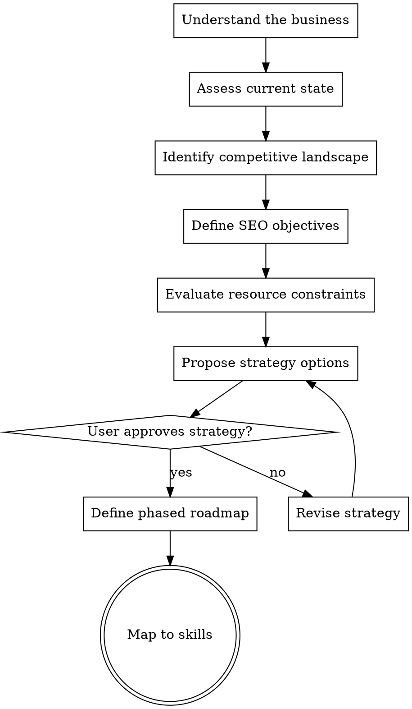

# SEO Brainstorming

## Overview

Strategic SEO planning before tactical execution. Understand the business, assess the current state, evaluate the competitive landscape, and define a phased strategy. Modeled after the superpowers brainstorming skill — no tactical work until strategy is defined and approved.


## The Iron Law

```
NO TACTICS WITHOUT STRATEGY. NO EXCEPTIONS.
```

<HARD-GATE>
Do NOT invoke tactical skills (technical-audit, keyword-research, content-optimization, etc.) until strategy is defined and approved by the user. This applies to EVERY project regardless of perceived simplicity. Running an audit without knowing what you're trying to achieve is how you end up with a 50-page report that nobody acts on.
</HARD-GATE>

## Anti-Pattern: "Let's Just Start Auditing"

Every SEO project goes through strategy first. A small blog, a Fortune 500 site, a local business — all of them. "Just audit it" without understanding goals is how agencies produce shelfware. The strategy can be short for simple projects — a few sentences is fine — but it must exist and be approved before any tactical skill fires.

## Checklist

You MUST create a task for each of these items and complete them in order:

1. **Understand the business** — Goals, revenue model, target audience, unique value proposition
2. **Assess current state** — Existing organic traffic, rankings, content, technical health (high-level)
3. **Identify competitive landscape** — Who ranks for target topics, market saturation, barriers to entry
4. **Define SEO objectives** — Specific, measurable goals tied to business outcomes
5. **Evaluate resource constraints** — Budget, team, content production capacity, technical access
6. **Propose strategy options** — 2-3 approaches with trade-offs
7. **Select and define strategy** — Chosen approach with phased roadmap
8. **Map to skills** — Which seo-superpowers skills to run and in what order

## Process Flow



## The Process

### Step 1: Understand the business

Ask the user (one question at a time):
- What does the business do? What's the core offering?
- How does the business make money? (E-commerce, leads, ads, SaaS, services)
- Who is the target audience? What problems do they solve for them?
- What makes this business different from competitors?
- Is there an existing website? How long has it been live?

### Step 2: Assess current state

Gather a high-level picture (not a full audit — that comes after strategy). **Check analytics-mcp first before asking the user about traffic.**

**MCP-first path (try this first):**
1. Use `get_account_summaries` to check if analytics-mcp is available and find the right GA4 property
2. If available, pull a quick organic traffic snapshot using `run_report`:
   - Dimensions: `date`, `sessionDefaultChannelGroup`; Metrics: `sessions`, `totalUsers`
   - Date range: last 3 months, compared to previous 3 months
   - Filter to organic channel — report the monthly session volume and trend direction (growing/flat/declining)
3. Summarize findings to the user: "Your site gets roughly X organic sessions/month, trending [up/down/flat] over the last 3 months."

**Fallback path (only if analytics-mcp is not configured):**
Ask the user:
- Is there existing organic traffic? Roughly how much?
- Are there existing rankings for target keywords?

**Always ask (regardless of MCP availability):**
- How much content exists? Blog, product pages, landing pages?
- Any known technical issues? (Slow site, indexation problems, recent redesign)
- Has SEO been done before? What worked or didn't?

### Step 3: Identify competitive landscape

- Who are the main business competitors?
- Who actually ranks for the target topics? (SERP competitors may differ from business competitors)
- How saturated is the market? Are there dominant players with massive authority?
- Are there underserved niches or topic gaps?
- What barriers to entry exist? (High domain authority requirements, YMYL topics, established brands)

### Step 4: Define SEO objectives

Help the user set specific, measurable goals:
- **Traffic goals:** "Increase organic sessions by X% in Y months"
- **Ranking goals:** "Rank on page 1 for [specific keywords]"
- **Revenue goals:** "Generate X leads/sales per month from organic"
- **Visibility goals:** "Establish topical authority in [topic area]"

Goals must connect to business outcomes — ranking for vanity keywords isn't a strategy.

### Step 5: Evaluate resource constraints

Understand what's realistic:
- **Budget:** Is there budget for tools, content, link building, technical work?
- **Team:** Who will implement? In-house team, agency, the user themselves?
- **Content capacity:** How many pages per month can be created/updated?
- **Technical access:** Can they make site changes? CMS limitations?
- **Timeline:** What's the expected timeline for results?

Match ambition to resources — a 5-page-per-year content capacity can't support a 500-keyword strategy.

### Step 6: Propose strategy options

Present 2-3 approaches with trade-offs. Common strategy archetypes:

**Content-led strategy:** Focus on creating comprehensive content to build topical authority
- Best when: Good content capacity, topics with informational demand, building from scratch
- Risk: Slow to show revenue impact, requires sustained effort

**Technical-led strategy:** Fix technical foundation to unlock existing content's potential
- Best when: Existing content assets, known technical debt, quick wins available
- Risk: Limited ceiling if content is weak

**Competitive-gap strategy:** Target specific keywords and topics where competitors are weak
- Best when: Strong competitors but identifiable gaps, niche opportunities
- Risk: Gaps may be small or temporary

**Quick-win strategy:** Focus on low-hanging fruit first to build momentum
- Best when: Limited resources, need to prove ROI, existing rankings to improve
- Risk: Quick wins run out — needs to evolve into a sustained strategy

Lead with your recommended approach and explain why given the business context.

### Step 7: Select and define strategy

Once the user approves an approach:
- Define the phased roadmap (Phase 1: months 1-3, Phase 2: months 4-6, etc.)
- Set milestones for each phase tied to objectives
- Identify the first 3-5 actions to take
- Define how to measure progress

### Step 8: Map to skills

Recommend which seo-superpowers skills to run and in what order:

| Phase | Skill | Purpose |
|-------|-------|---------|
| 1 | `seo-superpowers:technical-audit` | Fix foundation |
| 1 | `seo-superpowers:keyword-research` | Identify targets |
| 2 | `seo-superpowers:content-coverage` | Plan content |
| 2 | `seo-superpowers:content-optimization` | Improve existing |
| 3 | `seo-superpowers:link-analysis` | Evaluate link profile |
| ongoing | `seo-superpowers:analytics-review` | Track progress |

Offer to invoke the first skill in the sequence.

## Red Flags - STOP and Follow Process

If you catch yourself thinking:
- "This is straightforward, let's just start the audit"
- "The user knows what they want, skip the questions"
- "We already know the strategy — it's SEO"
- "Strategy is overkill for a small site"
- "Let me just run a quick keyword research first"
- "The user is impatient, let's get to the tactical stuff"

**ALL of these mean: STOP. Strategy first. Always.**

## Common Rationalizations

| Excuse | Reality |
|--------|---------|
| "The user just wants an audit" | An audit without goals produces a report nobody acts on. 5 minutes of strategy saves hours of wasted work. |
| "This is a simple project" | Simple projects still need direction. A 3-sentence strategy is fine. No strategy is not. |
| "We don't have time for strategy" | You don't have time to NOT do strategy. Unfocused tactical work is the biggest time waste in SEO. |
| "The competitive landscape is obvious" | Business competitors ≠ SERP competitors. Check who actually ranks. |
| "They just need more traffic" | More traffic is not a goal. More traffic to do what? Convert? Build authority? Sell? That changes everything. |
| "SEO strategy is always the same" | A SaaS company, a local plumber, and a news site need fundamentally different approaches. |

## Key Principles

- Strategy is a choice about what NOT to do as much as what to do
- Business goals drive SEO strategy, not the other way around
- Quick wins first, then sustained growth — build momentum before tackling hard problems
- One question at a time — don't overwhelm with a questionnaire
- Match ambition to resources — an unrealistic strategy is worse than no strategy
- Strategy can be simple — a few sentences for a small project is fine, but it must exist
