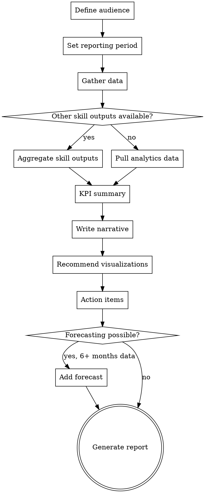

# SEO Reporting

## Overview

Create stakeholder-appropriate SEO reports that tell a story, not just dump data. Adapts depth and language to the audience — executives get KPIs and narrative, technical teams get detail and fix instructions. Aggregates findings from other seo-superpowers skills into cohesive reports.


## The Iron Law

```
A REPORT THAT DOESN'T CHANGE BEHAVIOR IS A WASTE OF EVERYONE'S TIME.
```

Every number needs a "so what." Every finding needs a recommendation. If the reader finishes your report and doesn't know what to do next, the report failed.

## Checklist

You MUST create a task for each of these items and complete them in order:

1. **Define audience** — Client, executive, technical team, or mixed?
2. **Set reporting period** — Monthly, quarterly, or ad-hoc. Define comparison period.
3. **Gather data** — Aggregate outputs from other skills if available. Pull analytics data.
4. **KPI summary** — Organic sessions, conversions, revenue, visibility, rankings for target keywords
5. **Narrative** — What happened, why, and what we're doing about it
6. **Visualizations** — Recommend chart types for each metric
7. **Action items** — What was done, what's next, what's blocked
8. **Forecasting** — If enough data, project next period trends with confidence bands
9. **Generate report** — Output in audience-appropriate format

## Process Flow



## The Process

### Step 1: Define audience

Ask the user who will read this report:

| Audience | Depth | Language | Focus |
|----------|-------|----------|-------|
| **Executive/C-suite** | High-level KPIs only | No jargon, business impact | ROI, revenue, competitive position |
| **Client (marketing manager)** | Moderate detail | Some SEO terms OK | Progress, actions taken, results, next steps |
| **Technical team** | Full detail | Technical SEO terms | Issues found, fix instructions, implementation specs |
| **Mixed** | Layered (summary → detail) | Progressive disclosure | Summary for leadership, appendix for technical team |

### Step 2: Set reporting period

- **Monthly:** Most common for ongoing SEO work
- **Quarterly:** Better for strategy-level reviews
- **Ad-hoc:** After a specific event (migration, algorithm update, campaign)
- **Comparison period:** Same period last year (preferred) or previous period
- Account for seasonality — flag if comparing periods with different seasonal profiles

### Step 3: Gather data

Sources:
- **Other skill outputs:** If `analytics-review`, `technical-audit`, `keyword-research`, or other skills were run this period, aggregate their findings
- **Analytics MCP:** Use `run_report` for traffic, conversion, landing page data
- **GSC data:** Clicks, impressions, CTR, position data
- **Manual:** Ask user for exported data if MCP not available

### Step 4: KPI summary

Standard SEO KPIs:

| KPI | Current | Previous | Change | Target | Status |
|-----|---------|----------|--------|--------|--------|
| Organic sessions | ... | ... | +/-% | ... | On/Off track |
| Organic conversions | ... | ... | +/-% | ... | On/Off track |
| Organic revenue | ... | ... | +/-% | ... | On/Off track |
| Keywords in top 3 | ... | ... | +/- | ... | On/Off track |
| Keywords in top 10 | ... | ... | +/- | ... | On/Off track |
| Avg. position (target KWs) | ... | ... | +/- | ... | On/Off track |
| Organic CTR | ... | ... | +/-pp | ... | On/Off track |

### Step 5: Narrative

Tell the story — not just what happened, but WHY and WHAT WE'RE DOING:

Structure:
1. **This period's headline** — One sentence summarizing performance ("Organic traffic grew 15% driven by new blog content targeting commercial keywords")
2. **What worked** — Actions that produced positive results
3. **What didn't work** — Honest about challenges and setbacks
4. **External factors** — Algorithm updates, seasonal changes, competitive shifts
5. **What we're doing about it** — Actions planned for next period

Avoid: data recitation without interpretation, hiding bad news, taking credit for seasonal trends.

### Step 6: Visualizations

Recommend chart types (the user will create these in their tool of choice):

| Metric | Chart Type | Why |
|--------|-----------|-----|
| Traffic over time | Line chart | Shows trends clearly |
| Channel breakdown | Stacked area or bar | Shows organic's share |
| Keyword position changes | Grouped bar or heatmap | Shows movement direction |
| Top pages performance | Horizontal bar | Easy to compare |
| Conversion funnel | Funnel chart | Shows drop-off points |
| Year-over-year comparison | Dual-axis line | Normalizes seasonality |

Avoid pie charts for trends. Use them only for composition at a point in time.

### Step 7: Action items

Three categories:

**Completed this period:**
- What was done
- What results it produced (or "too early to measure")

**Planned for next period:**
- What will be done
- Expected impact
- Who is responsible

**Blocked/at risk:**
- What can't proceed and why
- What's needed to unblock

### Step 8: Forecasting

Only if sufficient historical data (6+ months minimum):
- Project organic traffic for next 3-6 months based on trend
- Show confidence bands (optimistic, likely, pessimistic)
- Note assumptions (no major algorithm changes, continued content production, etc.)
- Be transparent about uncertainty — SEO forecasting is inherently imprecise

### Step 9: Generate report

Use the appropriate template from `report-templates.md`. Output a complete report document.

## Red Flags - STOP and Follow Process

If you catch yourself:
- Dumping data tables without narrative — you've built a dashboard, not a report
- Hiding bad news behind good metrics — you'll lose credibility when they find out
- Taking credit for seasonal traffic increases — that's dishonest and easily discovered
- Using the same report format for executives and technical teams — you're failing one audience
- Reporting metrics without recommended actions — numbers without next steps are useless

## Common Rationalizations

| Excuse | Reality |
|--------|---------|
| "The data speaks for itself" | Data never speaks for itself. It needs interpretation, context, and recommendations. |
| "They just want to see the numbers" | They want to know what the numbers MEAN and what to DO about them. |
| "We can't explain the traffic drop" | Then say that honestly, describe what you've investigated, and outline your plan to diagnose it. |
| "More data is better" | More relevant data is better. More data is noise. Five meaningful insights beat fifty data points. |
| "Forecasting is too risky" | State assumptions and confidence bands. Being transparent about uncertainty is more valuable than avoiding the topic. |

## Key Principles

- Reports tell stories, not dump data — every number needs context and interpretation
- Adapt to the audience — an executive doesn't need crawl error counts
- Honest about what didn't work — credibility comes from transparency
- Every metric needs a "so what" — don't report numbers without recommended actions
- Less is more — 5 meaningful insights beat 50 data points
