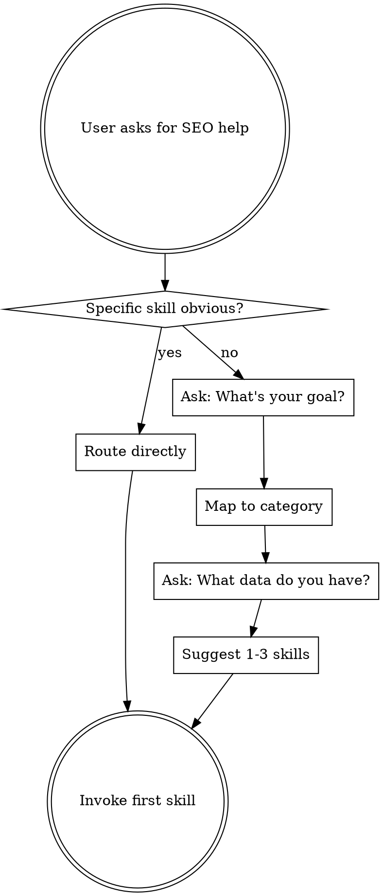

# SEO Triage — Skill Router

## Overview

Route users to the right SEO skill. When the task is ambiguous, ask clarifying questions to identify the best workflow. When it's obvious, route directly.

This skill is injected into every session. It serves as the entry point for all SEO work.

## The Iron Law

```
ROUTE FIRST. A WRONG SKILL WASTES MORE TIME THAN ONE MORE CLARIFYING QUESTION.
```

## Skill Catalog

### Discovery & Strategy

| Skill | Description | Trigger Keywords |
|-------|-------------|-----------------|
| `seo-superpowers:seo-brainstorming` | Strategic planning before tactics — goals, resources, approach | strategy, plan, where to start, SEO roadmap, prioritize |
| `seo-superpowers:keyword-research` | Keyword discovery, intent classification, clustering, mapping | keywords, search terms, what to target, content opportunities |
| `seo-superpowers:competitor-analysis` | SERP competitors, content gaps, backlink gaps, benchmarking | competitors, who ranks, gap analysis, share of voice |

### Technical Foundation

| Skill | Description | Trigger Keywords |
|-------|-------------|-----------------|
| `seo-superpowers:technical-audit` | Crawlability, indexation, speed, CWV, structured data | audit, crawl, speed, Core Web Vitals, indexing, robots.txt |
| `seo-superpowers:site-migration` | Domain changes, URL restructures, platform migrations | migration, domain change, redesign, URL structure, redirects |

### Content & On-Page

| Skill | Description | Trigger Keywords |
|-------|-------------|-----------------|
| `seo-superpowers:content-optimization` | Title tags, meta descriptions, headings, E-E-A-T, semantic coverage | optimize page, title tag, meta description, on-page, headings |
| `seo-superpowers:content-coverage` | Topic clusters, content gaps, cannibalization, content calendar | content strategy, topic clusters, content gaps, cannibalization |

### Off-Page & Links

| Skill | Description | Trigger Keywords |
|-------|-------------|-----------------|
| `seo-superpowers:link-analysis` | Backlink profile, toxicity, anchor text, internal links | backlinks, link profile, toxic links, anchor text, disavow |
| `seo-superpowers:digital-pr-outreach` | Link building campaigns, PR angles, outreach prospects | link building, outreach, digital PR, earn links, linkable assets |

### Measurement & Reporting

| Skill | Description | Trigger Keywords |
|-------|-------------|-----------------|
| `seo-superpowers:analytics-review` | GA4/GSC analysis, traffic trends, anomalies, conversion insights | analytics, traffic, Search Console, GA4, traffic drop, CTR |
| `seo-superpowers:seo-reporting` | Stakeholder reports, KPI dashboards, ROI measurement | report, dashboard, KPIs, present results, SEO ROI |
| `seo-superpowers:serp-trends-analysis` | Google Trends, SERP feature changes, seasonal patterns | trends, seasonal, SERP features, emerging topics, Google Trends |

### Specialized

| Skill | Description | Trigger Keywords |
|-------|-------------|-----------------|
| `seo-superpowers:local-seo` | Google Business Profile, NAP, local pack, citations, reviews | local SEO, Google Business, local pack, NAP, citations, reviews |
| `seo-superpowers:international-seo` | Hreflang, ccTLD vs subfolder, localization, geotargeting | international, hreflang, multilingual, country targeting, localization |
| `seo-superpowers:ai-search-optimization` | AI Overviews, entity SEO, knowledge graph, LLM visibility | AI search, AI Overviews, SGE, ChatGPT search, entity SEO |

## Routing Logic



## The Process

### Direct Routing

If the user's request clearly matches a single skill, invoke it immediately:
- "Audit my site" → `seo-superpowers:technical-audit`
- "Research keywords for X" → `seo-superpowers:keyword-research`
- "Optimize this page" → `seo-superpowers:content-optimization`
- "Analyze my analytics" → `seo-superpowers:analytics-review`
- "Check my backlinks" → `seo-superpowers:link-analysis`

### Guided Routing

When the task is ambiguous, use AskUserQuestion to narrow down:

**Question 1: "What's your goal?"**
Map the answer to a skill category:
- Improve rankings → Technical audit or content optimization
- Get more traffic → Keyword research or content coverage
- Understand performance → Analytics review
- Beat competitors → Competitor analysis
- Build links → Link analysis or digital PR outreach
- Plan strategy → SEO brainstorming
- Report results → SEO reporting

**Question 2: "What data do you have?"**
Determines the data gathering path within the skill:
- Analytics MCP configured → MCP-first path
- Tool exports available → Manual data path
- Just a URL → WebFetch path
- Nothing yet → Skill will guide data collection

### Suggesting Skills

After routing, suggest 1-3 skills ordered by priority. Offer to invoke the first one. Example:

> Based on your goal, I recommend:
> 1. **Technical audit** — fix the foundation first
> 2. **Content optimization** — improve what you have
> 3. **Keyword research** — find new opportunities
>
> Want me to start with the technical audit?

## Multi-Skill Chains

Common workflow chains for complex goals:

**Full Site Audit:**
`seo-brainstorming` → `technical-audit` → `content-coverage` → `analytics-review` → `seo-reporting`

**Content Strategy:**
`keyword-research` → `competitor-analysis` → `content-coverage` → `content-optimization`

**Performance Investigation:**
`analytics-review` → `technical-audit` → `content-optimization`

**New Site Launch:**
`seo-brainstorming` → `keyword-research` → `content-coverage` → `technical-audit`

**Link Building Campaign:**
`link-analysis` → `competitor-analysis` → `digital-pr-outreach`

**Market Expansion:**
`international-seo` → `keyword-research` → `content-coverage` → `technical-audit`

## Key Principles

- If a specific skill clearly matches, route directly without questions
- Always offer to list all skills when the user seems unsure
- Suggest skill chains for complex goals, not just single skills
- One question at a time — don't overwhelm with a questionnaire
- When in doubt, start with `seo-brainstorming` to define strategy first
