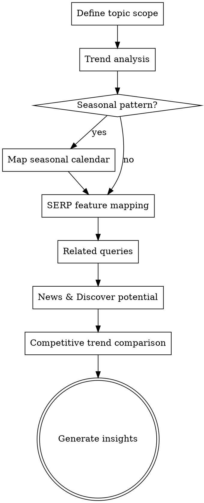

# SERP & Trends Analysis

## Overview

Analyze search demand trends, SERP feature composition, and seasonal patterns to inform timing and content strategy. Identifies emerging topics before they peak, declining queries to deprioritize, and SERP features to target.


## The Iron Law

```
TRENDS TELL YOU WHEN, NOT JUST WHAT. TIMING IS A COMPETITIVE ADVANTAGE.
```

Publishing the right content at the wrong time is almost as bad as publishing the wrong content. If you're writing your "summer recipes" guide in July, you've already lost. Trends analysis exists to give you a timing edge.

## Checklist

You MUST create a task for each of these items and complete them in order:

1. **Define topic scope** — Keywords or topic area to analyze
2. **Trend analysis** — Rising vs declining interest, seasonal patterns, geographic variation
3. **SERP feature mapping** — Which features appear for target queries
4. **Related queries** — Rising related searches, breakout topics, adjacent opportunities
5. **Seasonal planning** — Map high/low demand periods to content calendar
6. **News & Discover potential** — Topics with spike potential, freshness signals
7. **Competitive trend comparison** — Brand interest trends vs competitors
8. **Generate insights** — Trend report with timing recommendations and opportunity scores

## Process Flow



## The Process

### Step 1: Define topic scope

- What keywords or topic area are we analyzing?
- What's the geographic focus? (Global, country-specific, regional)
- What time range? (Past 12 months for trends, past 5 years for seasonal patterns)
- What's the goal? (Timing content, identifying opportunities, understanding demand shifts)

### Step 2: Trend analysis

For each target keyword/topic:
- **Direction:** Is interest rising, declining, or stable over the analysis period?
- **Velocity:** How fast is the change? Gradual shift vs sudden spike/drop?
- **Geographic variation:** Does interest vary by region? Are there untapped geographic markets?
- **Category context:** Is the entire category trending, or just this specific term?

Data gathering:
- **MCP path:** Use WebFetch to pull Google Trends pages for target keywords
- **WebSearch:** Search for target keywords to see current SERP state
- **Manual fallback:** Ask user for Google Trends screenshots or exports

### Step 3: SERP feature mapping

For each target keyword, check which SERP features appear:

| Feature | Impact on Organic | Opportunity |
|---------|------------------|-------------|
| **AI Overview** | Reduces clicks to organic results | Get cited as a source |
| **Featured snippet** | Can capture position 0 | Format content to match snippet type |
| **People Also Ask** | Additional visibility opportunity | Create content answering PAA questions |
| **Video carousel** | Reduces organic real estate | Create video content |
| **Image pack** | Visual results take clicks | Optimize image SEO |
| **Local pack** | Dominates above-fold for local queries | Optimize GBP |
| **Shopping results** | Commercial intent captured by ads | Consider paid + organic strategy |
| **Knowledge panel** | Entity-level visibility | Optimize entity SEO |
| **News carousel** | Timely content opportunity | Freshness and news angle |

Use WebSearch to check actual SERPs for 10-20 target keywords.

### Step 4: Related queries

Discover adjacent opportunities:
- **Rising queries:** Related searches with increasing interest — early-mover advantage
- **Breakout queries:** New searches with explosive growth (>5000% in Google Trends)
- **Top related queries:** Most common related searches — ensure coverage
- **Questions:** "How to", "what is", "why" variations — content opportunities

Use WebSearch to check "People Also Ask" and related searches for key terms.

### Step 5: Seasonal planning

If seasonal patterns exist:
- Map peak and trough periods for each topic
- Identify the lead time — when to publish content before the peak (typically 2-3 months before)
- Plan content calendar around seasonal demand:
  - **Pre-season:** Publish and optimize content
  - **Peak season:** Promote, update with current year data
  - **Post-season:** Update for next year's keywords, maintain rankings

Example seasonal map:

| Topic | Peak Month(s) | Publish By | Update By |
|-------|--------------|------------|-----------|
| "tax software" | Feb-Apr | December | January |
| "christmas gifts" | Nov-Dec | September | October |
| "summer recipes" | Jun-Aug | April | May |

### Step 6: News & Discover potential

Evaluate topics for spike potential:
- **News-worthy angles:** Data releases, industry events, regulatory changes, seasonal events
- **Discover optimization:** Content freshness signals, high-quality images, engaging headlines
- **Trending topic hijacking:** How to create relevant content when a related topic trends
- **Content freshness:** Which existing pages could be updated to capture trending interest?

### Step 7: Competitive trend comparison

- Compare brand search interest vs competitors over time
- Is your brand awareness growing, stable, or declining relative to competitors?
- Identify competitors with rising brand interest — what are they doing differently?
- Check if competitor-branded searches reveal product or feature interest you should cover

### Step 8: Generate insights

Output format:

**Trend Summary:**

| Keyword/Topic | Trend | Seasonality | SERP Features | Opportunity Score |
|---------------|-------|-------------|---------------|-------------------|
| ... | Rising ↑ | Peak: Jun-Aug | Snippet, PAA | High |
| ... | Declining ↓ | None | AI Overview | Low |
| ... | Stable → | Peak: Nov-Dec | Video, Shopping | Medium |

**Timing Recommendations:**
- When to publish content for each topic
- When to update existing content
- Seasonal content calendar integration

**Emerging Opportunities:**
- Rising queries to target now
- Breakout topics to monitor
- SERP features to optimize for

**Declining Topics:**
- Keywords losing interest — deprioritize or pivot
- Topics being absorbed by AI Overviews — adapt strategy

## Red Flags - STOP and Follow Process

If you catch yourself:
- Analyzing trends without mapping them to a content calendar — insights without timing are trivia
- Ignoring seasonality because "our niche isn't seasonal" — almost every niche has seasonal patterns
- Treating all SERP features the same — an AI Overview changes the keyword's value fundamentally
- Looking at trends without checking the actual SERP — a rising keyword means nothing if the SERP is dominated by features you can't compete in
- Not comparing brand interest trends — declining brand searches are a leading indicator you can't afford to miss

## Common Rationalizations

| Excuse | Reality |
|--------|---------|
| "Trends don't apply to our niche" | Every niche has demand patterns. You just haven't looked. |
| "We'll worry about timing later" | Later means you publish after the peak. Your competitors planned ahead. |
| "SERP features don't affect us" | If an AI Overview captures 40% of clicks, that keyword is worth 40% less to you. That affects you. |
| "We can't predict what will trend" | You can't predict spikes, but you can absolutely predict seasonal patterns and plan for them. |
| "We just need evergreen content" | Even evergreen content benefits from strategic timing of updates and promotion. |

## Key Principles

- Trends inform timing, not just topic selection — publishing at the right time matters as much as choosing the right topic
- Rising trends have more opportunity than peaked trends — early movers win
- SERP features change the game — a keyword with an AI Overview has different value than one without
- Seasonal patterns are predictable — use them as a competitive advantage by planning ahead
- Brand interest trends are a leading indicator — declining brand searches often precede traffic drops
