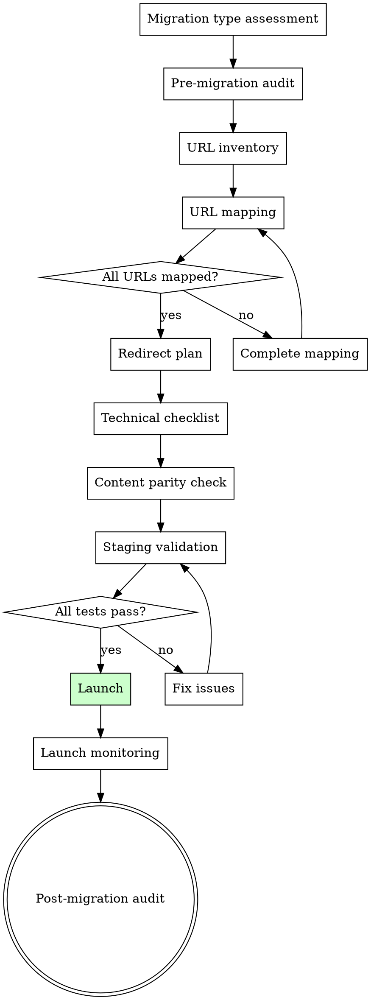

# Site Migration

## Overview

Plan and execute website migrations without losing search equity. Migrations are the highest-risk SEO event — a botched migration can destroy years of organic growth. This skill provides the systematic process to minimize risk: baseline, map, redirect, validate, monitor.


## The Iron Law

```
EVERY URL WITH TRAFFIC, RANKINGS, OR BACKLINKS GETS A REDIRECT. NO EXCEPTIONS.
```

Migrations are the highest-risk SEO event. A botched migration can destroy years of organic growth in a day. If you think "most pages don't need redirects," you're wrong — and you'll find out the hard way in your traffic graphs.

## Checklist

You MUST create a task for each of these items and complete them in order:

1. **Migration type assessment** — Domain change, URL restructure, platform change, HTTPS, redesign
2. **Pre-migration audit** — Baseline current rankings, traffic, indexed pages, backlink profile
3. **URL inventory** — Complete list of current URLs with traffic/ranking data
4. **URL mapping** — Old URL → New URL mapping for every page
5. **Redirect plan** — 301 redirects for every mapped URL. Chain detection.
6. **Technical checklist** — Robots.txt, sitemaps, canonical tags, hreflang, structured data on new site
7. **Content parity check** — No content loss during migration
8. **Staging validation** — Test redirects, check for 404s, validate technical elements before launch
9. **Launch monitoring** — Crawl new site immediately, check GSC coverage, monitor rankings
10. **Post-migration audit** — 1 week, 1 month, 3 month checkpoints
11. **Generate migration plan** — Full timeline with responsible parties and rollback criteria

## Process Flow



## SEO Plan Integration
**On start:** If `seo-plan.md` exists, read it. Use Strategy, Technical Health, and Performance for context.
**On completion:** Add a `### Migration` subsection under a `## Specialized` section (create if missing) with migration type, risk level, timeline, and status. Append to Action Log. If file doesn't exist, don't create it.

## The Process

### Step 1: Migration type assessment

Identify the migration type — risk and complexity vary significantly:

| Type | Risk Level | Key Concern |
|------|-----------|-------------|
| **HTTP → HTTPS** | Low | Mixed content, internal links, canonical updates |
| **Domain change** | Very High | All backlink equity must transfer via redirects |
| **URL restructure** | High | Every changed URL needs a redirect |
| **Platform change** | High | URL patterns, rendering, technical SEO may change |
| **Redesign (same URLs)** | Medium | Content parity, internal link changes, rendering changes |
| **Site merge** | Very High | Consolidation decisions, multiple redirect sources |

### Step 2: Pre-migration audit

Establish baselines — you can't measure impact without knowing the starting point:
- **Organic traffic:** Last 12 months of organic sessions (monthly)
- **Rankings:** Current positions for all tracked keywords
- **Indexed pages:** Total pages indexed in GSC
- **Backlink profile:** Top linking domains, total referring domains
- **Top pages:** Top 50 pages by organic traffic with URLs, traffic, and rankings
- **Technical baseline:** Site speed, CWV scores, structured data

Save all baseline data — you'll compare against this at 1 week, 1 month, and 3 months post-migration.

### Step 3: URL inventory

Create a complete list of every URL on the current site:
- Crawl data (Screaming Frog, Sitebulb, or similar)
- XML sitemap URLs
- GSC indexed URLs
- Analytics landing pages with organic traffic

For each URL, record:
- Organic sessions (last 12 months)
- Rankings and keywords
- Backlinks (referring domains)
- HTTP status code

**No URL should be left behind.** Every URL with traffic, rankings, or backlinks needs a redirect.

### Step 4: URL mapping

Map every old URL to its new URL equivalent:

| Old URL | New URL | Status | Notes |
|---------|---------|--------|-------|
| /old-page | /new-page | Mapped | Direct equivalent exists |
| /old-category/page | /new-category/page | Mapped | Structure changed |
| /removed-page | /closest-relevant-page | Mapped (no direct match) | Content removed, redirect to most relevant |
| /thin-content-page | — | No redirect (410) | Content with no value, no traffic, no links |

Rules:
- **Never assume URLs haven't changed** — verify every mapping
- **Map to the most relevant new URL** — don't dump everything to the homepage
- **410 Gone** only for pages with zero traffic, zero links, and no content value
- **Preserve query parameters** if they're used for tracking or functionality

### Step 5: Redirect plan

- **301 redirects** for all mapped URLs (permanent)
- **302 redirects** only for temporary changes (rare in migrations)
- **Redirect chains:** Verify no old redirects create chains (A → B → C). Every redirect should go directly to the final destination.
- **Redirect loops:** Test for loops before implementation
- **Implementation method:** Server-level redirects (.htaccess, nginx config, edge workers) — not JavaScript or meta refresh
- **Regex patterns:** Use regex redirects for systematic URL pattern changes, with specific redirects for exceptions

### Step 6: Technical checklist

On the new site, verify:
- **robots.txt:** Not blocking crawlers. Updated sitemap reference.
- **XML sitemap:** Contains all new URLs. Old URLs removed. Submitted to GSC.
- **Canonical tags:** Self-referencing canonicals on all new URLs. No canonicals pointing to old URLs.
- **Hreflang:** Updated to reference new URLs (if international)
- **Structured data:** Present and valid on new site. Updated URLs in markup.
- **Internal links:** All internal links point to new URLs (not relying on redirects)
- **Analytics:** Tracking code installed on all pages. Goals/conversions configured.
- **GSC:** New property verified (if domain change). Sitemap submitted.

Reference `migration-checklist.md` for the complete pre-launch and post-launch checklists.

### Step 7: Content parity check

- **No content loss:** Every important page on the old site has equivalent content on the new site
- **Title tags:** Preserved or improved (not made generic by new template)
- **Meta descriptions:** Preserved or improved
- **Heading structure:** Maintained
- **Internal links:** Key internal links preserved
- **Images and media:** Not lost in migration

Spot-check 20-30 representative pages across all page types.

### Step 8: Staging validation

Before launch, test on staging:
- **Redirect testing:** Verify a sample of redirects (100% of high-traffic pages, random sample of others)
- **404 check:** Crawl the new site for broken links
- **Rendering:** Verify pages render correctly for search engines (check JavaScript rendering)
- **Mobile:** Test on mobile devices
- **Speed:** Compare page speed to baseline
- **Structured data:** Validate with testing tools

**Do not launch until all critical tests pass.**

### Step 9: Launch monitoring

Immediately after launch:
- **Crawl the entire new site** — check for 404s, redirect errors, orphan pages
- **Submit new sitemap to GSC** — request indexing for key pages
- **Monitor GSC coverage** — watch for indexing errors
- **Monitor real-time traffic** — confirm tracking is working
- **Check redirects in production** — verify they work (staging ≠ production)
- **Monitor server errors** — 5xx errors under load

### Step 10: Post-migration audit

Scheduled checkpoints comparing to baseline:

**24 hours:**
- Redirects working?
- Traffic tracking functional?
- Any 5xx errors?

**1 week:**
- GSC indexing the new URLs?
- Any significant traffic drops?
- 404 errors in GSC?

**1 month:**
- Traffic recovery vs baseline (20-30% temporary drop is normal for domain migrations)
- Rankings recovery for target keywords
- Indexed page count trending toward baseline
- Old URLs being deindexed, new URLs being indexed

**3 months:**
- Full traffic comparison to baseline
- Ranking recovery assessment
- Backlink profile — are links resolving to new URLs?
- Identify any remaining issues

### Step 11: Generate migration plan

Output a complete migration document:

**Migration Summary:** Type, scope, timeline, risk level

**Pre-Launch Timeline:**
- [ ] Week -4: Complete URL inventory and mapping
- [ ] Week -3: Implement redirects on staging
- [ ] Week -2: Technical checklist and content parity
- [ ] Week -1: Staging validation and sign-off
- [ ] Launch day: Execute migration

**Launch Day Checklist:** Step-by-step actions for launch day

**Post-Launch Monitoring Schedule:** What to check and when

**Rollback Criteria:** Define conditions that trigger a rollback (e.g., >50% traffic drop sustained for 48 hours)

**Responsible Parties:** Who does what

## Red Flags - STOP and Follow Process

If you catch yourself:
- Launching without testing redirects on staging — staging exists for a reason
- Mapping "most" URLs and planning to "fix the rest later" — later means after you've lost the traffic
- Removing redirects after a few months because "it's been long enough" — keep redirects for at least 1 year
- Skipping the pre-migration baseline — you can't measure impact without knowing the starting point
- Launching on a Friday — issues discovered over the weekend when nobody's available to fix them

## Common Rationalizations

| Excuse | Reality |
|--------|---------|
| "Most pages don't get traffic anyway" | Pages with backlinks pass equity even without traffic. Check every URL. |
| "We'll fix redirects after launch" | Every day without redirects is a day of lost equity. Fix before launch or don't launch. |
| "The new site is better, traffic will recover" | A better site with broken redirects will lose traffic. Quality and redirects are independent problems. |
| "We can just redirect everything to the homepage" | Google treats mass homepage redirects as soft 404s. You'll lose per-page equity. |
| "We don't need a rollback plan" | If you don't need a rollback plan, you haven't understood the risk. |

## Key Principles

- Migrations are the highest-risk SEO event — treat them with appropriate caution
- No URL left behind — every URL with traffic, rankings, or links needs a redirect
- Test before launch — staging validation prevents production disasters
- Monitor aggressively post-launch — catch issues in hours, not weeks
- Some traffic loss is normal — 10-20% temporary drop is expected, 30%+ sustained is a problem
- Keep redirects in place for at least 1 year — removing redirects too early loses equity
