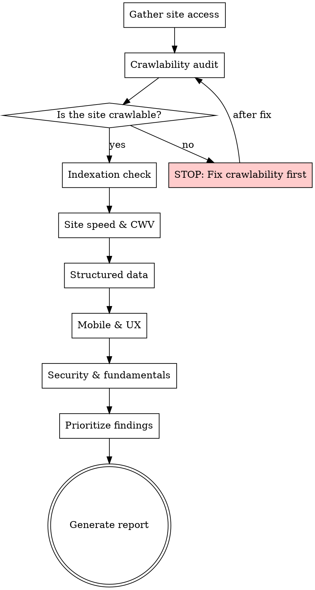

# Technical SEO Audit

## Overview

Systematic technical SEO audit workflow. Start with crawlability — nothing else matters if search engines can't reach the pages — then work through indexation, speed, structured data, mobile, and security. Every finding gets a severity classification and a fix recommendation.


## The Iron Law

```
CRAWLABILITY FIRST. EVERYTHING ELSE IS THEATRE UNTIL GOOGLEBOT CAN REACH THE PAGES.
```

If the site has fundamental crawlability blockers, STOP. Don't assess page speed on a site that's blocked by robots.txt. Don't check structured data on a site returning 5xx errors. Fix access first, audit second.

## Checklist

You MUST create a task for each of these items and complete them in order:

1. **Gather site access** — Get URL, check for sitemap, robots.txt
2. **Crawlability audit** — robots.txt rules, meta robots, canonical tags, redirect chains, orphan pages
3. **Indexation check** — site: search estimate, noindex pages, thin content, duplicate content
4. **Site speed & CWV** — LCP, INP, CLS thresholds, render-blocking resources
5. **Structured data** — JSON-LD presence, schema types, validation issues
6. **Mobile & UX** — Viewport, tap targets, font sizes, intrusive interstitials
7. **Security & fundamentals** — HTTPS, mixed content, HTTP/2, compression
8. **Prioritize findings** — Classify each finding as Critical/High/Medium/Low
9. **Generate report** — Executive summary + findings table + priority action list

## Process Flow



## SEO Plan Integration
**On start:** If `seo-plan.md` exists, read it. Use Strategy and Rules & Decisions for context.
**On completion:** Update the Technical Health section with severity counts and priority fix. Append to Action Log. If file doesn't exist, don't create it.

## The Process

### Step 1: Gather site access

- Get the target URL from the user
- Use WebFetch to retrieve the homepage and check HTTP status, redirects, response headers
- Fetch `/robots.txt` — parse directives, check for disallow rules affecting key pages
- Fetch `/sitemap.xml` (or sitemap index) — check existence, format, page count
- If sitemap not at default location, check robots.txt for sitemap directive
- Ask user if they have crawler exports (Screaming Frog, Sitebulb) or GSC access for deeper data

### Step 2: Crawlability audit

- **robots.txt:** Review all User-agent rules. Flag overly broad disallow rules. Check for crawl-delay.
- **Meta robots:** Check pages for noindex, nofollow, none directives that may be unintentional
- **Canonical tags:** Verify self-referencing canonicals on key pages. Flag pages pointing canonical to wrong URL.
- **Redirect chains:** Follow redirects. Flag chains >1 hop. Flag redirect loops. Check HTTP → HTTPS and www → non-www consistency.
- **Orphan pages:** If sitemap and crawler data available, identify pages in sitemap but not internally linked (and vice versa)

<HARD-GATE>
If the site has fundamental crawlability blockers — robots.txt blocking all, site returning 5xx errors, entire domain noindexed — STOP. Report these as Critical. Do NOT continue to Step 3. Optimizing page speed on a site Google can't reach is like polishing a car with no engine.
</HARD-GATE>

### Step 3: Indexation check

- Estimate indexed pages via `site:domain.com` search (use WebSearch)
- Compare indexed count to sitemap page count — large discrepancy indicates problems
- Check for unintentional noindex tags on important pages
- Identify thin content pages (<300 words with no unique value)
- Check for duplicate content — multiple URLs serving same content, missing canonicals
- Check URL parameter handling — are parameters creating duplicate URLs?

### Step 4: Site speed & CWV

CWV thresholds: LCP < 2.5s, INP < 200ms, CLS < 0.1 (measured at p75 of field data).

- **LCP (Largest Contentful Paint):** Identify the LCP element. Check for lazy-loaded hero images, slow server response, render-blocking CSS/JS.
- **INP (Interaction to Next Paint):** Check for heavy JavaScript, long tasks, event handler bottlenecks.
- **CLS (Cumulative Layout Shift):** Check for images without dimensions, dynamic content injection, web fonts causing layout shift.
- **Other speed factors:** Render-blocking resources, uncompressed images, missing browser caching headers, excessive DOM size.

Data gathering:
- **MCP path:** Use WebFetch to check page weight, resource count, response times
- **Manual fallback:** Ask user for PageSpeed Insights results, Lighthouse report, or CrUX data

### Step 5: Structured data

- Check for JSON-LD structured data on key page types
- Identify schema types used (Article, Product, LocalBusiness, FAQ, HowTo, BreadcrumbList, etc.)
- Validate against schema.org requirements — required vs recommended properties
- Check for common errors: missing @context, invalid types, incorrect nesting
- Identify opportunities for additional schema based on page content

### Step 6: Mobile & UX

- Check viewport meta tag presence and configuration
- Verify responsive design — no horizontal scrolling, readable font sizes
- Check tap target sizing (minimum 48x48px with 8px spacing)
- Flag intrusive interstitials (full-screen popups, app install banners that block content)
- Check for mobile-specific issues: unplayable content, Flash, fixed-width elements

### Step 7: Security & fundamentals

- **HTTPS:** Verify all pages served over HTTPS. Check for mixed content (HTTP resources on HTTPS pages).
- **HTTP/2 or HTTP/3:** Check protocol version via response headers
- **Compression:** Verify gzip or brotli compression on text resources
- **Security headers:** Check for HSTS, X-Content-Type-Options, X-Frame-Options (note but don't overweight — these are security, not SEO, but signal site quality)

### Step 8: Prioritize findings

Classify every finding using this severity framework:

| Severity | Criteria | Examples |
|----------|----------|----------|
| **Critical** | Prevents indexing or causes major ranking loss | robots.txt blocking site, sitewide noindex, 5xx errors, HTTPS not configured |
| **High** | Significantly impacts rankings or user experience | Poor CWV scores, missing canonicals causing duplication, redirect chains |
| **Medium** | Impacts performance but not catastrophically | Missing structured data, suboptimal title tags, missing alt text |
| **Low** | Best practice improvements with marginal impact | Missing security headers, minor compression opportunities |

### Step 9: Generate report

Output format:

**Executive Summary** — 3-5 sentences: overall site health, critical blockers, top priority actions.

**Findings Table:**

| # | Finding | Severity | Category | Impact | Fix |
|---|---------|----------|----------|--------|-----|
| 1 | ... | Critical | Crawlability | ... | ... |

**Priority Action List** — Ordered by severity then effort. Each action: what to do, why it matters, expected impact.

## Red Flags - STOP and Follow Process

If you catch yourself thinking:
- "Let's skip crawlability, the site loads fine in a browser"
- "We don't need to check robots.txt, it's probably fine"
- "CWV doesn't matter much for this kind of site"
- "I'll just list the issues without severity"
- "The user wants quick results, let's skip the full audit"
- "This is a small site, it doesn't need a systematic audit"

**ALL of these mean: STOP. You're cutting corners. Follow the process.**

## Common Rationalizations

| Excuse | Reality |
|--------|---------|
| "The site loads fast in my browser" | Your browser ≠ Googlebot. Check server response, rendering, and CrUX data. |
| "It's a small site, skip the full audit" | Small sites have the same technical requirements. The audit will just be faster. |
| "CWV doesn't matter for low-traffic sites" | CWV is a ranking factor regardless of traffic. And low traffic might be *because* of poor CWV. |
| "Let's just list issues without prioritizing" | An unprioritized list is useless. The user needs to know what to fix first. |
| "robots.txt is probably fine" | "Probably" is not a technical assessment. Fetch it and read it. |
| "We can skip structured data, it's not critical" | Missing structured data means missing rich results. That's lost CTR. |
| "The user only asked about speed" | Speed issues often have root causes in crawlability and indexation. Check the foundation first. |

## Key Principles

- Always check crawlability first — nothing else matters if Googlebot can't reach the pages
- Don't just list issues — explain WHY each matters and HOW to fix it
- Severity must reflect actual ranking/indexing impact, not theoretical best practices
- Tools-agnostic: works with any crawler data, not locked to specific tools
- A clean bill of health is a valid finding — not every audit must produce a crisis
